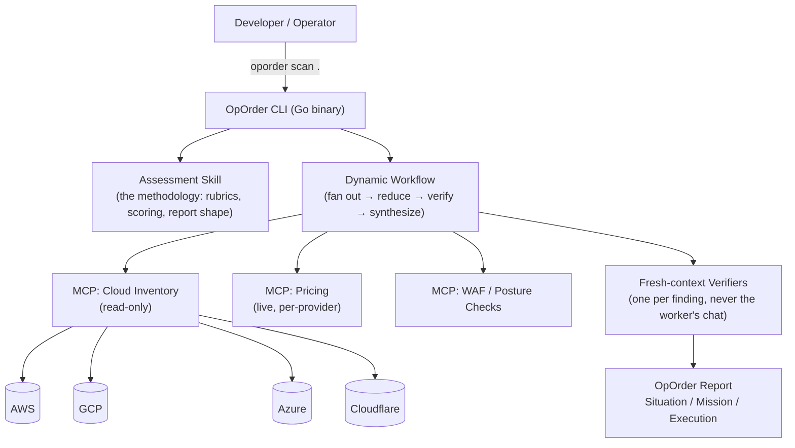

# OpOrder — Specification v0.1

> Status: design document. Nothing in this repo executes yet. This is the plan the build
> gets held to, and it gets revised in the open as reality pushes back on it.

---

## 0. Vision

A developer runs one command against a codebase and a cloud account. Ten minutes later they
have an honest picture of what they're actually running, a straight answer on whether to
rehost, replatform, refactor, rearchitect, repurchase, retire, or retain it, what it will
cost in real dollars either way, and how long it will take. Nobody who built the tool makes
more money depending on which answer comes out.

That's the whole product. Everything below is how it gets built without quietly becoming
something else.

---

## 1. Non-negotiable design principles

These aren't aspirations — they're constraints the architecture has to enforce mechanically,
not just promise in a README, because a promise a competitor can't structurally keep isn't a
differentiator, and neither is one you can quietly abandon under commercial pressure.

| Principle | What it rules out |
|---|---|
| **The recommendation must be able to cost the tool nothing.** "Retain," "repatriate," and "retire" have to be reachable outcomes, weighted identically to every migration path. | Any scoring logic that can't reach those three conclusions on real evidence is disqualified, full stop, before it ships. |
| **Assessment and execution stay structurally separate.** OpOrder produces the plan. It never runs the migration, writes the production code, or touches the client's deploy pipeline. | No "auto-fix" mode. No `oporder execute`. Ever. |
| **Every scoring decision is visible in the repo.** Anyone can read exactly why a workload got scored "replatform" instead of "refactor." | No opaque model call standing in for a documented rubric. If the LLM makes the call, the rubric it was given ships in the same PR. |
| **Nothing leaves the user's boundary they didn't approve.** Self-hosted by default. | No default telemetry, no default cloud callback, no "phone home for a nicer report." |
| **A worker never grades its own homework.** Every finding gets checked by a fresh-context agent before it reaches the report. | No self-verification loops. See [[08-Harness-and-Loops / 09-Agent-Design-Patterns / 20-Graph-Engineering]] pattern already validated in the Code To Cloud vault. |
| **A contributor should be able to submit a real PR after reading one file.** Architectural elegance that requires understanding four subsystems before anyone can help is a tax on exactly the community growth this project depends on. | No feature ships behind more indirection than it currently needs. See §4.2 — the fancier architecture is *earned*, not assumed from day one. |
| **Vendor-neutrality applies to the tooling ecosystem too, not just the cloud.** The plain CLI has to work with zero AI agent host installed. | No feature that only works inside one vendor's agent product (Claude Code, Cursor, etc.) is allowed to become load-bearing. See §4.3. |

---

## 2. What everyone else has already built, and what that tells us

Condensed from the full competitive research already done for this project — this is the
evidence the design below is built against, not a guess.

### 2.0 The proof this category works at real scale: Government of Alberta

Before the vendor landscape below, the single strongest piece of evidence for this whole
project, and it's local: in July 2026, Alberta's Ministry of Technology and Innovation used
**Claude Agent SDK + Claude Code (Opus and Sonnet)** to scan **466 million lines of code
across 27 provincial ministries — 1,280 applications, 3,400 repositories — in about 20
hours**, a task they estimate would otherwise take **6.5 years and roughly $2 billion**.
Some legacy systems were then rebuilt in **4–5 days** versus an original 5-month estimate.

Their architecture independently validates several of this spec's design choices, arrived at
separately:
- **A "red team / blue team" agent split** — one agent probes for exploitation paths, a
  separate one assesses defenses and drafts remediation — the same fresh-context,
  never-grade-your-own-homework discipline as §1's verification principle and §5.7, just
  named differently.
- **A two-stage pipeline**: a deterministic rules engine flags known patterns first, then an
  LLM does the judgment-call review with exact file/line citations — the same
  computational-vs-inferential split this spec applies throughout (§7's testing strategy is
  built on the identical distinction).
- **Mixed model tiers** (Opus for judgment, Sonnet for volume) — the same cheap-model-for-
  boring-nodes, strong-model-for-judgment-nodes pattern already validated in the Code To
  Cloud Agentic Engineering vault's Graph Engineering work.

Alberta published their methodology as **The Velocity Papers** (thevelocitywhitepapers.com)
— free, open, step-by-step technical white papers, explicitly offered as "a roadmap other
governments could follow." **What they did not publish is a reusable, installable tool** —
it's documentation of a bespoke effort built by a dedicated ministry team over roughly 18
months, not something a mid-market company or a solo engineer can `go install` and point at
their own estate. That gap — a proven, government-validated methodology with no productized
way for anyone else to run it — is exactly what OpOrder exists to close. The Velocity Papers
are required reading before finalizing §5's rubric design, not just a citation.

**The honest caveat**: Alberta's numbers reflect a provincial government's resourcing,
direct scale, and presumably direct vendor support — they are the upper bound of what's
possible with this category of tooling, not a baseline OpOrder v0.1 should imply it matches
on day one. Cite the pattern, not the throughput.

| Category | Who | What we take from them | What we deliberately don't repeat |
|---|---|---|---|
| Hyperscaler-native agentic migration | AWS Transform, Copilot app modernization, watsonx Code Assistant for Z | Real agentic pipelines work at scale (AWS Transform: 4.5B+ lines processed year one). Full assessment → plan → code pipelines are technically proven. | Every one only ever recommends its own cloud. Structurally can't be trusted for a neutral second opinion — this is the entire gap OpOrder exists to fill. |
| Closed enterprise modernization | Blitzy ($1.4B valuation), Mechanical Orchard | Reverse-engineering a codebase into a dependency graph before touching it is the right first move — we do this too. | Closed source, enterprise-only, no way for a mid-market team or a skeptical engineer to read the reasoning. Also: their own published numbers (Bun rewrite: ~750K lines, 99.8% test pass, 11 days) get inflated in secondhand retellings — a lesson in citing primary sources, applied to our own eventual case studies too. |
| Open-source code modernization | Konveyor/Kai (Red Hat), Move2Kube | RAG over a rules corpus plus static analysis, rather than a bare LLM call, is how you get modernization suggestions that are actually checkable. We adopt the same shape for the code-analysis layer. | Narrow scope (Java EE→Quarkus, K8s only). We're the assessment layer *above* this kind of tool, not a replacement for it — OpOrder can recommend "refactor," Konveyor-style tooling is a fine choice for who actually executes that. |
| Auto architecture diagrams | Hava.io, Cloudockit | Live-account diagramming that stays current is genuinely useful and undersupplied in open source (CloudMapper's diagram feature is abandoned upstream). | Closed, paid SaaS, cloud-account-only — no code-level understanding, no recommendation layer on top. |
| Cost / Well-Architected tooling | Infracost, Powerpipe/Steampipe AWS Well-Architected mod | Live pricing APIs beat baked-in numbers. Both are Go, single-binary, self-hosted — the exact distribution shape we want. | Single-cloud (AWS-centric) and IaC-diff focused, not migration-decision focused. We borrow the pricing-API pattern, not the scope. |
| Migration execution/orchestration | AWS Cloud Migration Factory (OSS, Apache 2.0) | Wave planning and cutover orchestration are a solved, separate problem from assessment. | This is the *execution* layer. We don't compete with it or replicate it — a completed OpOrder should be able to feed straight into a tool like this. |

**The gap, stated precisely:** nobody combines live-infrastructure assessment, code-level
understanding, an honest 5/7-Rs call (including "don't migrate"), cross-provider
Well-Architected scoring, and real cost/effort numbers, in one open, self-hosted,
vendor-neutral tool. That's the whole product.

---

## 3. The output: what an OpOrder actually contains

```
oporder-report/
├── SITUATION.md       # the as-is: diagram, inventory, dependency map, tech debt signals
├── MISSION.md         # per-workload 5/7-Rs recommendation, with the rubric and evidence shown
├── EXECUTION.md        # cost estimate, effort estimate, sequencing, target service mapping
├── waf-scorecard.json  # cross-provider Well-Architected pillar scores, machine-readable
├── sdlc-maturity.json  # branching/CI/test/release maturity signals feeding the effort estimate
└── architecture.svg    # the live-state diagram, regenerable on every run
```

### 3.1 SITUATION — what's actually there

- Architecture diagram generated from **live infrastructure state**, not from source code
  alone (source tells you intent; the account tells you truth, and they drift — this is the
  gap CloudMapper's abandoned diagram feature and Archify's code-only diagrams both leave
  open).
- Dependency graph: service-to-service, service-to-managed-resource, and code-level module
  dependencies, merged into one graph.
- Plain-English inventory: what's running, what's talking to what, what nobody seems to be
  using (usage telemetry, where the provider exposes it, feeds the "retire" candidate list).

### 3.2 MISSION — the honest call

For every workload, one of: **rehost · replatform · refactor · rearchitect · repurchase ·
retire · retain** (the 7 Rs — see §5.3), with:
- The specific evidence that drove the call (e.g. "3 of 4 managed-service dependencies have
  no equivalent on the target platform → refactor, not rehost").
- A stated confidence level, not false precision.
- What would have to change for the call to flip (the anchor a human can push back against).

### 3.3 EXECUTION — what it costs, in both directions

- **Destination hosting cost**, live-priced (§5.6), compared across every viable target —
  including "stay exactly where you are" and "repatriate to owned hardware" as first-class
  options, not footnotes.
- **The cost of doing the work**: engineering effort estimate (§5.6), plus transparent
  reporting of what generating *this report* itself cost in tokens — if OpOrder isn't willing
  to show its own cost, it has no business estimating anyone else's.
- **Sequencing**: which workloads block which, surfaced from the dependency graph, not
  guessed.

---

## 4. System architecture



### 4.1 Why this shape, not a monolith

- **The CLI is the only thing users install.** A single Go binary, no runtime dependency,
  same reasoning Infracost, Steampipe, and driftctl already made — it's why they all cross-
  compile cleanly to Linux, macOS, and WSL2 with zero friction. We follow the same precedent
  rather than inventing a new one.
- **The MCP servers are the only thing that touches a cloud account or a pricing API.**
  Isolating I/O behind MCP means the assessment logic (the skill) never needs its own
  bespoke per-provider client code, and a contributor can add a fifth provider by writing one
  MCP server, not by touching the reasoning engine.
- **The skill carries the methodology, not the code.** The 5/7-Rs rubric, the WAF scoring
  normalization, the SDLC-maturity signals — all human-readable, versioned, diffable. This is
  what principle #3 (§1) actually looks like in the repo, not just in the README.
- **The workflow is the diamond pattern** already documented for this exact use case in the
  Code To Cloud Agentic Engineering vault (`20-Graph-Engineering.md`): fan out per workload,
  reduce in plain code, verify each finding with a **fresh-context** agent, synthesize once.
  This is not a new architecture invented for this spec — it's the validated pattern applied.

### 4.2 Complexity is earned, not assumed

The four-piece architecture in §4 (CLI, MCP servers, skill, workflow) is the *end state*,
not the v0.1 starting point — and that distinction matters more for this project's actual
survival than any diagram does. Concretely:

- **v0.1 ships as a plain Go CLI** that calls provider SDKs directly. No MCP servers, no
  skill/workflow split. A Go developer can open `main.go`, understand the whole program,
  and submit a PR to add a check without knowing what MCP even stands for.
- **The MCP/skill/workflow decomposition arrives only when something real forces it** —
  specifically, when the assessment logic needs to run inside other agent hosts (Claude
  Code, Cursor, etc.) rather than just this CLI, which is a genuine, distinct requirement,
  not a speculative one. Until that day, the extra indirection has no justification and is
  pure contribution friction.
- **"Add a fifth provider" should always be the easy PR.** Whatever the current
  architecture is at any given phase, that specific contribution path gets kept simple and
  documented (§8's `docs/architecture/` requirement applies from v0.1, even before there's
  anything architecturally complex to document) — it's the single most likely first
  contribution from an outside developer, and it's the one that should never require a
  maintainer's hand-holding to complete.

### 4.3 Interoperability with agentic standards, not lock-in to one

Vendor-neutrality applies recursively — to which AI tooling can use OpOrder, not just which
cloud it recommends:

- **MCP (Model Context Protocol)** stays the integration surface once §4.2's "something real
  forces it" threshold is met — it's already cross-vendor (Anthropic, OpenAI, and Google all
  support it), which is exactly why it's the right choice over a bespoke integration API.
- **AGENTS.md compatibility**: any coding agent reading a repo's `AGENTS.md` should be able to
  learn how to invoke `oporder` in that repo. A cheap addition with real reach, since
  AGENTS.md is a cross-vendor convention, not specific to any one agent product.
- **A Claude Code Plugin is one distribution channel, not the architecture.** Packaging the
  assessment skill and MCP server as an installable Claude Code plugin (once §4.2 justifies
  MCP existing at all) is a legitimate way to reach that specific audience — it should never
  become a reason the core logic only works inside Claude Code.
- **A2A (Agent2Agent protocol)** is worth watching, not building against yet: the day
  OpOrder's plan needs to hand off to a separate execution agent programmatically rather than
  to a human, A2A is the emerging cross-vendor way to do that handoff without OpOrder needing
  to know anything about the specific agent receiving it.
- **`llms.txt`** on the eventual docs site (§9) — a small, low-cost addition that makes the
  documentation itself legible to any agent evaluating whether to recommend OpOrder, not just
  to search engines.

**The test for adopting any of these:** does it stay optional, and does the plain CLI still
work with zero of them installed? If yes, add it. If a feature only works inside one vendor's
agent host, it doesn't belong in this project — same discipline as refusing to favor one
cloud, applied to the tooling ecosystem itself.

### 4.4 Platform support matrix

| Platform | Support level | Notes |
|---|---|---|
| Linux (x86_64, arm64) | First-class | Primary CI target |
| macOS (Intel, Apple Silicon) | First-class | |
| WSL2 | First-class | Same binary as Linux; no WSL-specific shims needed if we avoid anything that assumes a native Windows filesystem path |
| Native Windows (non-WSL) | Not targeted for v1 | Revisit only if real demand shows up — see Gap Analysis §12 |

### 4.5 Provider support matrix — containers and serverless first

| Provider | Container target | Serverless target | Live pricing source | Notes |
|---|---|---|---|---|
| AWS | ECS, EKS, Fargate | Lambda | AWS Price List API | Most mature target; broadest existing tooling to compare against |
| GCP | GKE, Cloud Run | Cloud Functions | Cloud Billing Catalog API (confirmed live, REST + RPC) | Cloud Run blurs container/serverless — treat as its own row in output, not forced into one bucket |
| Azure | AKS, Container Apps | Azure Functions | Azure Retail Prices API — `https://prices.azure.com/api/retail/prices` (confirmed live) | |
| Cloudflare | Workers (+ Containers, verify current GA status at build time) | Workers | **No public pricing API as of this writing** — needs a maintained scrape/manual-update path, flagged honestly in §12 | Real migration path already documented by Cloudflare: DNS → R2 → D1 → Workers. R2's zero egress fee is a first-class input to the cost model, not a footnote — it can flip a recommendation on its own for egress-heavy workloads. |

---

## 5. The assessment engine

### 5.1 Code analysis layer

- Static dependency graph (tree-sitter–based, language-agnostic parsing — the approach
  used by the `codeknow` open-source project, which already proves this works with zero API
  keys and no fine-tuning).
- Proprietary-SDK detection: flags direct calls to vendor-specific APIs (Step Functions,
  EventBridge triggers, Azure Logic Apps connectors) — this is where "rehost" quietly becomes
  "refactor" and most naive migration estimates go wrong.
- SDLC-maturity signals: branch protection, CI presence, test coverage where measurable,
  release cadence from git history. Feeds directly into the effort estimate (§5.6) — an
  untested monolith costs more to move than a well-tested one, regardless of size.

### 5.2 Live infrastructure layer (via MCP)

- Inventory: what's deployed, where, at what scale.
- Utilization: CPU/memory/traffic where the provider exposes it — the primary signal for
  flagging "retire" candidates, since nobody manually goes looking for unused resources.
- IAM and network topology: input to the WAF security-pillar scoring, and to blast-radius
  estimation for sequencing.

### 5.3 The 5/7-Rs decision rubric

Each workload is scored against explicit, documented triggers — not a bare model call with
no visible reasoning:

| R | Primary trigger |
|---|---|
| **Retain** | Low business criticality, acceptable current cost, no compliance or EOL driver forcing action |
| **Repatriate** | Steady-state predictable load + high egress cost + cloud premium exceeds owned-hardware TCO over the depreciation horizon |
| **Rehost** | Containerizable or VM-portable, no proprietary managed-service dependencies detected, migration deadline is the dominant constraint |
| **Replatform** | 1:1 managed-service swap available (e.g. self-managed DB → managed DB) with minimal code change |
| **Refactor** | Proprietary dependencies with no target-platform equivalent, but the core logic is sound |
| **Rearchitect** | Monolith requiring decomposition to meet a stated goal (e.g. the container/serverless targets in §4.5) |
| **Repurchase** | Equivalent SaaS/COTS functionality is cheaper than continued maintenance |
| **Retire** | Usage telemetry shows no or negligible traffic; redundant with another system |

Every trigger above must resolve from **evidence gathered in §5.1/5.2**, not from the model's
unstated priors. Where evidence is ambiguous, the report says so explicitly rather than
picking a confident-sounding answer — a stated "insufficient evidence, here's what would
resolve it" beats a wrong confident one.

### 5.4 Well-Architected scoring, normalized across providers

AWS, Azure, and GCP each publish their own well-architected framework, with different pillar
names and counts. OpOrder maps all three onto one canonical rubric (Security, Reliability,
Performance, Cost, Operations, Sustainability) so a cross-cloud comparison is actually
apples-to-apples — this normalization step is real, non-trivial work and is called out
explicitly in the Gap Analysis (§12) as a place the mapping will need active maintenance as
providers update their own frameworks.

### 5.5 SDLC maturity scoring

A lens, not a platform (see §1 principle on assess/execute separation, and the earlier
decision in this project's history to keep SDLC *guidance* in scope while ruling out SDLC
*execution*). Feeds the effort estimate and the confidence level on any Refactor/Rearchitect
call — a team with no tests attempting a rearchitect is a materially different risk profile
than one with green CI, and the report says so.

### 5.6 Cost engine

**Destination hosting cost** — live-queried at report time, never baked in:
- AWS Price List API, Azure Retail Prices API, GCP Cloud Billing Catalog API — all confirmed
  live and queryable without a sales call.
- Cloudflare — no equivalent public API exists today; see §12 for the honest maintenance
  plan this requires.

**Cost of doing the work** — two numbers, both shown, both distrusted by default until
verified:
1. **Token cost of the assessment itself.** Every OpOrder report states what it cost in LLM
   spend to generate. A tool unwilling to show its own bill has no standing to estimate
   anyone else's.
2. **Engineering effort estimate**, derived from codebase size, complexity, SDLC maturity
   (§5.5), and the specific R selected — expressed as a range with the assumptions shown,
   never a bare number. Ranges get audited against real completed engagements over time,
   the same way any estimating model has to earn trust.

### 5.7 Verification discipline

Every finding is checked by a **fresh-context verifier agent** before it reaches the report
— never the same conversation that produced the finding. Three parallel checks per finding,
matching the pattern already validated in this vault's Graph Engineering work: is it
correct, is it current, is the source real. A finding that fails majority verification is
dropped, not softened.

---

## 6. CLI UX — the gold standard bar

The bar: a developer opens this tool for a five-minute look and it's still the thing they
reach for a year later. Concretely:

```
$ oporder scan .

  OpOrder v0.1.0 · scanning ./ (git: main @ 4f2a91c)

  ⠋ Reading code................ 142 services detected
  ⠋ Connecting to AWS........... read-only, us-east-1 + 3 more regions
  ⠋ Fanning out assessment...... 142 workers, 3 fresh verifiers each
  ⠋ Pricing (live)............... AWS Price List API, GCP Billing Catalog, Azure Retail Prices
  ⠋ Synthesizing report.........

  Done in 4m12s · $0.38 in LLM spend · full report: ./oporder-report/

  12 retain · 34 rehost · 41 replatform · 28 refactor · 9 rearchitect · 6 repurchase · 12 retire

  Biggest finding: `billing-service` has 4 undocumented dependencies on a deprecated
  internal API. See SITUATION.md#billing-service.

  Next: oporder report --open
```

Principles this enforces:
- **Show real numbers as they happen** — cost, count, elapsed time — never a bare spinner.
  Silence during a long-running scan is the single fastest way to lose trust in a tool that's
  supposed to be about honesty.
- **One command, sensible defaults, deep configurability behind flags** — the same shape as
  `git`, not a wizard.
- **The summary line is the whole point.** Most people will read the terminal output and
  never open the full report — it has to be honest and complete on its own.
- **Every subcommand composes**: `oporder scan`, `oporder report`, `oporder waf`,
  `oporder cost` all work standalone against a previous scan's cache, not just as one
  monolithic run.

---

## 7. Testing strategy

Two different problems, two different testing approaches — conflating them is where most
AI-tool testing goes wrong:

1. **Deterministic logic** (the 5/7-Rs rubric evaluation, WAF pillar mapping, cost
   arithmetic, report rendering): standard unit and golden-file/snapshot tests. No excuse for
   these to be anything less than rigorous — none of this is non-deterministic.
2. **LLM-mediated reasoning** (the verifier agents, the narrative sections of the report):
   an **eval suite**, not unit tests — a fixed set of real-world-shaped fixture repositories
   and mock cloud states with a known-correct answer, run against every model/prompt change,
   scored for drift. This is the same discipline the vault's own Agentic Engineering learning
   path already prescribes ("write 20 eval cases for an LLM-shaped feature") — applied to our
   own product, not just recommended to others.
3. **Provider API mocking**: every MCP server ships a recorded-fixture mode so the full test
   suite runs with zero live cloud credentials and zero cost — a contributor should be able
   to `make test` on a plane.
4. **Adversarial fixtures on purpose**: at least one test repo per provider deliberately
   engineered to trigger every one of the 7 Rs, plus a "genuinely ambiguous, correct answer
   is 'insufficient evidence'" fixture — because a tool that can't admit uncertainty in tests
   won't admit it in production either.

---

## 8. Documentation strategy

- `README.md` — the pitch (already written).
- `SPEC.md` — this document, kept current as the source of truth, not a launch artifact that
  goes stale.
- `docs/rubric.md` — the full 5/7-Rs and WAF scoring logic in plain language, so a skeptical
  reader can audit the reasoning without reading Go source.
- `docs/architecture/` — one page per MCP server / skill / workflow, each with its own
  "what it does, what it doesn't do, what it never sends anywhere."
- `CONTRIBUTING.md` — how to add a fifth cloud provider, written as an actual walkthrough
  with a real PR as the reference example once one exists, not an abstract checklist.
- Every generated report is itself documentation — self-describing enough that someone
  encountering it with zero context on OpOrder can still follow the reasoning.

---

## 9. Website — Omarchy-style

A single, fast, dark-mode-first scrolling page, not a marketing site with a nav bar and six
tabs:
- Above the fold: the one-liner, the install command, nothing else.
- A terminal-recording GIF/asciinema embed of an actual `oporder scan` run — the real UX
  from §6, not a mockup.
- One scroll section per pillar of §1 (vendor-neutral, assess-don't-execute, open scoring,
  self-hosted, fresh-context verification) — each one a claim plus the mechanism that
  enforces it, not just an assertion.
- A live-updating "what it found" wall of anonymized, opt-in example findings from real
  community runs, once that data exists — social proof that's actually true, not testimonial
  copy.
- Footer: license, GitHub link, Code To Cloud attribution, nothing else competing for
  attention.

---

## 10. Roadmap

| Phase | Scope | Architecture | Exit criteria |
|---|---|---|---|
| v0.1 | AWS only. Live inventory + diagram + plain-English SITUATION.md. No Mission/Execution yet. | Plain Go CLI, direct AWS SDK calls — no MCP/skill/workflow split (§4.2) | A stranger can run it against a real AWS account and trust the diagram, and a Go developer can read `main.go` end to end |
| v0.2 | 5/7-Rs MISSION.md, AWS only, rubric fully documented. | Same plain CLI | The rubric survives a public read-through without an obvious hole |
| v0.3 | EXECUTION.md — live AWS cost + effort estimate. Eval suite live in CI. | Same plain CLI | A real cost estimate gets checked against a real completed migration, error margin published |
| v0.4 | GCP + Azure providers added. WAF cross-provider normalization live. | Provider clients still direct, one package per provider — decompose into MCP only if a concrete second agent-host integration need shows up (§4.2) | Same workload, three clouds, one honest comparison |
| v0.5 | Cloudflare added, with the pricing-data maintenance plan from §12 actually running. | | |
| v1.0 | All four providers, full test/eval coverage, docs site, public case study with a real organization's permission. | MCP/skill/workflow split lands here at the earliest, and only if something real needs it by now | Someone outside Code To Cloud ships a PR that adds a capability we didn't think of |

---

## 11. Devil's advocate — stress-testing this spec specifically

> [!danger] "The 7-Rs rubric in §5.3 will produce confidently wrong answers on real, messy codebases."
> Almost certainly true on day one. Real codebases have proprietary dependencies buried three
> layers deep in a config file the static analyzer never opens. **Mitigation, not cure:** the
> "insufficient evidence" outcome has to be exercised constantly in early usage, and every
> wrong call reported by a real user becomes a new eval fixture (§7). A rubric that never
> admits uncertainty in the field is worse than one that admits it too often.

> [!danger] "Cross-provider WAF normalization (§5.4) is quietly the hardest part of this whole spec, and it's one paragraph."
> Fair, and worth saying plainly: mapping three providers' differently-shaped frameworks onto
> one rubric, and keeping that mapping current as AWS/Azure/GCP revise their own frameworks,
> is genuinely ongoing maintenance work, not a one-time engineering task. This is likely the
> single highest-maintenance-cost line item in the whole roadmap and deserves its own tracked
> workstream, not a subsection.

> [!danger] "Nobody will trust cost numbers from a v0.1 tool with zero track record."
> Correct, and that's why §5.6 requires every estimate to ship with its assumptions visible
> and get audited against real outcomes over time — trust in the numbers has to be earned
> the same way Infracost or any estimating tool earned it: slowly, publicly, with errors
> owned rather than hidden.

> [!danger] "A Go CLI plus MCP servers plus a skill plus a workflow is four things to build and keep in sync, not one."
> Yes — this is real architectural complexity, chosen deliberately in §4.1 over a monolith
> specifically so a contributor can extend one piece without touching the others. The
> trade-off is real: more moving parts, in exchange for a codebase where "add GCP support"
> is a scoped PR instead of a rewrite. Worth revisiting if in practice the seams between
> pieces cause more bugs than the isolation saves.

> [!danger] "This spec assumes maintainer bandwidth this project doesn't have yet."
> The single biggest risk to the whole plan, flagged earlier in this project's own history
> and still true here: a roadmap this thorough is worthless without sustained review/triage
> capacity. **The roadmap in §10 should be read as sequential and gated, not parallel** —
> v0.2 doesn't start until v0.1 actually has real users, specifically so scope never outruns
> the hours available to ship it.

---

## 12. Gap analysis — open risks not fully resolved above

> [!warning] Cloudflare has no public pricing API.
> Every other provider in §4.5 has a live, queryable pricing source. Cloudflare doesn't.
> Options: maintain a manually-updated pricing table with a visible "last verified" date
> (honest but stale-prone), scrape the public pricing page (fragile, breaks silently), or
> scope Cloudflare cost estimates as "directional, verify before committing" in the report
> itself until a better source exists. No option here is fully satisfying — pick one
> explicitly rather than let it default silently.

> [!warning] "Cloudflare Containers" GA status needs verification at build time, not spec time.
> The research behind §4.5 confirmed Workers, D1, R2, and Durable Objects clearly; container
> support on Cloudflare specifically should be re-verified against current docs when v0.5
> actually starts, not assumed from this document.

> [!warning] Usage telemetry for "retire" candidates isn't equally available everywhere.
> AWS, Azure, and GCP expose utilization metrics with varying depth and default retention;
> a workload with no metrics isn't necessarily unused — it might just be un-instrumented.
> The rubric (§5.3) needs a documented fallback for "no telemetry available" that doesn't
> default to a false "retire" signal.

> [!warning] The effort-estimate model (§5.6) has no ground truth yet.
> It's specified as a heuristic — codebase size, complexity, SDLC maturity — with no
> validated coefficients, because none exist yet. This is explicitly an estimate that starts
> rough and gets corrected against real completed engagements. Treat any early number as a
> hypothesis, and say so in the UI, not just in this doc.

> [!warning] Multi-tenant / shared-service workloads break the "one workload, one R" model.
> §5.3 scores per workload, but real infrastructure has shared databases, shared queues, and
> platform services used by dozens of applications at once. The rubric as specified doesn't
> yet say what happens when two workloads that share a dependency get different Rs — this
> needs its own resolved design before v0.3, not an assumption that it'll sort itself out.

> [!warning] Native Windows (non-WSL2) is explicitly out of scope, and that's a real exclusion.
> Reasonable for a first release given the target audience, but worth stating as a conscious
> choice rather than an oversight, in case it turns out to matter more than expected.

> [!warning] Legal/compliance review time for the target buyer isn't modeled anywhere in the roadmap.
> §10's roadmap is all engineering milestones. The earlier research in this project
> established that enterprise adoption of a tool like this is gated by security/compliance
> review, not by feature completeness — that review cycle (SOC2 questions, data-flow
> diagrams, a security.txt, a documented threat model for the MCP servers) isn't a line item
> anywhere above and should be, likely starting around v0.3–v0.4 once real pilot users exist.

---

## 🔗 Related

- Code To Cloud Agentic Engineering vault: `20-Graph-Engineering.md` (the diamond pattern
  this workflow architecture is built on), `08-Harness-and-Loops.md`,
  `09-Agent-Design-Patterns.md`
- [README.md](README.md) — the pitch
- [LICENSE](LICENSE) — Apache 2.0
