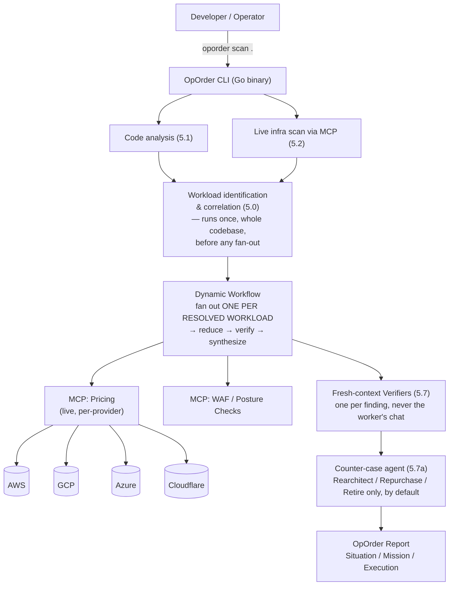

# OpOrder — Specification v0.1

> Status: design document. Nothing in this repo executes yet. This is the plan the build
> gets held to, and it gets revised in the open as reality pushes back on it.

---

## 0. Vision

A developer runs one command against a codebase and a cloud account. Ten minutes later they
have an honest picture of what they're actually running, a straight answer on whether to
rehost, replatform, refactor, rearchitect, repurchase, retire, or retain it, what it will
cost in real dollars either way, and how long it will take. Nobody who built the tool makes
more money depending on which answer comes out.

That's the whole product. Everything below is how it gets built without quietly becoming
something else.

The point of building it isn't to hand organizations a different authority to defer to. It's
to put the engineer, the developer, the organization back in the driving seat — with a real,
evidenced choice about what's actually right for their situation, instead of the choice a
vendor with something to sell them already made on their behalf. "Free to choose" only means
something if the choice is backed by the same rigor a hyperscaler's own tooling has, which is
why §13 holds this project to real versioning, release, and governance discipline rather than
letting "it's open source" stand in for engineering seriousness.

**Say the exciting part out loud, too — this doesn't have to be sold as cautious.** A
25-year-old, hand-coded Java portal that took five months to build the first time got rebuilt
in four to five days (§2.0). Bun's Zig-to-Rust port — hundreds of thousands of lines,
behavior-identical — ran in days, not years. That's not a marginal productivity gain, it's a
different order of magnitude, and the story this project tells should carry that energy
rather than undersell it into a compliance checklist. **What doesn't change while telling that
story**: OpOrder itself never does the rewrite. It's the neutral second opinion that tells you
honestly whether a rewrite is warranted and what it should target — genuinely amazing
execution is real, worth being loud about, and still someone else's job to carry out, by
design (§1's second principle). Selling the excitement of what AI-assisted rewrites can do is
not the same claim as OpOrder doing them, and conflating the two is exactly the trust-eroding
move this whole document exists to avoid.

---

## 1. Non-negotiable design principles

These aren't aspirations — they're constraints the architecture has to enforce mechanically,
not just promise in a README, because a promise a competitor can't structurally keep isn't a
differentiator, and neither is one you can quietly abandon under commercial pressure.

| Principle | What it rules out |
|---|---|
| **The recommendation must be able to cost the tool nothing.** "Retain," "repatriate," and "retire" have to be reachable outcomes, weighted identically to every migration path. | Any scoring logic that can't reach those three conclusions on real evidence is disqualified, full stop, before it ships. |
| **Assessment and execution stay structurally separate.** OpOrder produces the plan. It never runs the migration, writes the production code, or touches the client's deploy pipeline. | No "auto-fix" mode. No `oporder execute`. Ever. |
| **Every scoring decision is visible in the repo.** Anyone can read exactly why a workload got scored "replatform" instead of "refactor." | No opaque model call standing in for a documented rubric. If the LLM makes the call, the rubric it was given ships in the same PR. |
| **Nothing leaves the user's boundary they didn't approve.** Self-hosted by default. | No default telemetry, no default cloud callback, no "phone home for a nicer report." |
| **A worker never grades its own homework.** Every finding gets checked by a fresh-context agent before it reaches the report. | No self-verification loops. See [[08-Harness-and-Loops / 09-Agent-Design-Patterns / 20-Graph-Engineering]] pattern already validated in the Code To Cloud vault. |
| **A contributor should be able to submit a real PR after reading one file.** Architectural elegance that requires understanding four subsystems before anyone can help is a tax on exactly the community growth this project depends on. | No feature ships behind more indirection than it currently needs. See §4.2 — the fancier architecture is *earned*, not assumed from day one. |
| **Vendor-neutrality applies to the tooling ecosystem too, not just the cloud.** The plain CLI has to work with zero AI agent host installed. | No feature that only works inside one vendor's agent product (Claude Code, Cursor, etc.) is allowed to become load-bearing. See §4.3. |
| **Every recommendation shows pros and cons, never a bare verdict — and every surface looks considered, not default-tool ugly.** | No CLI output, TUI view, or report ships that only shows the "why we're right" side of a call, or that reads like an afternoon's unstyled output. See §6. |
| **A stated platform preference adds a lens, it never replaces the analysis.** Helping someone who's already decided is legitimate; quietly bending the evidence to flatter that decision isn't. | No `--prefer` flag is allowed to suppress or soften the neutral recommendation sitting right next to it. See §3.2. |
| **Any tool this project depends on or integrates with is open-source or free.** The barrier to actually running OpOrder has to stay low — a dependency behind a paywall contradicts the "low barrier, self-hosted, judge it yourself" pitch as directly as a bundled AI vendor key would. | No integration ships that requires a paid license, a subscription, or an account with a company that could revoke access. Go, Bubble Tea/Lip Gloss, the provider SDKs, and the draw.io MCP server (§6.3) all already clear this bar — it's a check applied to every future addition too, not a one-time audit. |

---

## 2. What everyone else has already built, and what that tells us

Condensed from the full competitive research already done for this project — this is the
evidence the design below is built against, not a guess.

### 2.0 The proof this category works at real scale: Government of Alberta

Before the vendor landscape below, the single strongest piece of evidence for this whole
project, and it's local: in July 2026, Alberta's Ministry of Technology and Innovation used
**Claude Agent SDK + Claude Code (Opus and Sonnet)** to scan **466 million lines of code
across 27 provincial ministries — 1,280 applications, 3,400 repositories — in about 20
hours**, a task they estimate would otherwise take **6.5 years and roughly $2 billion**.

The concrete example worth citing by name rather than only the aggregate numbers: a
**subsidy-program portal, hand-coded in Java roughly 25 years ago, that took five months to
build the first time** — rebuilt in **4–5 days**. That's not a rounding-error improvement,
and it's specific enough to be a real fixture archetype, not just a headline stat — §7's test
suite should include a synthetic "quarter-century-old, hand-coded, single-language monolith"
fixture modeled directly on this shape, since it's a documented, real-world case rather than
an invented edge case.

Their architecture independently validates several of this spec's design choices, arrived at
separately:
- **A "red team / blue team" agent split** — one agent probes for exploitation paths, a
  separate one assesses defenses and drafts remediation — the same fresh-context,
  never-grade-your-own-homework discipline as §1's verification principle and §5.7, just
  named differently.
- **A two-stage pipeline**: a deterministic rules engine flags known patterns first, then an
  LLM does the judgment-call review with exact file/line citations — the same
  computational-vs-inferential split this spec applies throughout (§7's testing strategy is
  built on the identical distinction).
- **Mixed model tiers** (Opus for judgment, Sonnet for volume) — the same cheap-model-for-
  boring-nodes, strong-model-for-judgment-nodes pattern already validated in the Code To
  Cloud Agentic Engineering vault's Graph Engineering work.

Alberta published their methodology as **The Velocity Papers** (thevelocitywhitepapers.com)
— free, open, step-by-step technical white papers, explicitly offered as "a roadmap other
governments could follow." **What they did not publish is a reusable, installable tool** —
it's documentation of a bespoke effort built by a dedicated ministry team over roughly 18
months, not something a mid-market company or a solo engineer can `go install` and point at
their own estate. That gap — a proven, government-validated methodology with no productized
way for anyone else to run it — is exactly what OpOrder exists to close. The Velocity Papers
are required reading before finalizing §5's rubric design, not just a citation.

**The honest caveat**: Alberta's numbers reflect a provincial government's resourcing,
direct scale, and presumably direct vendor support — they are the upper bound of what's
possible with this category of tooling, not a baseline OpOrder v0.1 should imply it matches
on day one. Cite the pattern, not the throughput.

| Category | Who | What we take from them | What we deliberately don't repeat |
|---|---|---|---|
| Hyperscaler-native agentic migration | AWS Transform, Copilot app modernization, watsonx Code Assistant for Z | Real agentic pipelines work at scale (AWS Transform: 4.5B+ lines processed year one). Full assessment → plan → code pipelines are technically proven. | Every one only ever recommends its own cloud. Structurally can't be trusted for a neutral second opinion — this is the entire gap OpOrder exists to fill. |
| Closed enterprise modernization | Blitzy ($1.4B valuation), Mechanical Orchard | Reverse-engineering a codebase into a dependency graph before touching it is the right first move — we do this too. | Closed source, enterprise-only, no way for a mid-market team or a skeptical engineer to read the reasoning. Also: their own published numbers (Bun rewrite: ~750K lines, 99.8% test pass, 11 days) get inflated in secondhand retellings — a lesson in citing primary sources, applied to our own eventual case studies too. |
| Open-source code modernization | Konveyor/Kai (Red Hat), Move2Kube | RAG over a rules corpus plus static analysis, rather than a bare LLM call, is how you get modernization suggestions that are actually checkable. We adopt the same shape for the code-analysis layer. | Narrow scope (Java EE→Quarkus, K8s only). We're the assessment layer *above* this kind of tool, not a replacement for it — OpOrder can recommend "refactor," Konveyor-style tooling is a fine choice for who actually executes that. |
| Auto architecture diagrams | Hava.io, Cloudockit | Live-account diagramming that stays current is genuinely useful and undersupplied in open source (CloudMapper's diagram feature is abandoned upstream). | Closed, paid SaaS, cloud-account-only — no code-level understanding, no recommendation layer on top. |
| Cost / Well-Architected tooling | Infracost, Powerpipe/Steampipe AWS Well-Architected mod | Live pricing APIs beat baked-in numbers. Both are Go, single-binary, self-hosted — the exact distribution shape we want. | Single-cloud (AWS-centric) and IaC-diff focused, not migration-decision focused. We borrow the pricing-API pattern, not the scope. |
| Migration execution/orchestration | AWS Cloud Migration Factory (OSS, Apache 2.0) | Wave planning and cutover orchestration are a solved, separate problem from assessment. | This is the *execution* layer. We don't compete with it or replicate it — a completed OpOrder should be able to feed straight into a tool like this. |

**The gap, stated precisely:** nobody combines live-infrastructure assessment, code-level
understanding, an honest 5/7-Rs call (including "don't migrate"), cross-provider
Well-Architected scoring, and real cost/effort numbers, in one open, self-hosted,
vendor-neutral tool. That's the whole product.

---

## 3. The output: what an OpOrder actually contains

```
oporder-report/
├── SITUATION.md       # the as-is: diagram, inventory, dependency map, tech debt signals
├── MISSION.md         # per-workload 5/7-Rs recommendation, with the rubric, evidence, and counter-case shown (§5.7a)
├── EXECUTION.md        # cost estimate, effort estimate, sequencing, target service mapping
├── waf-scorecard.json  # cross-provider Well-Architected pillar scores, machine-readable
├── sdlc-maturity.json  # branching/CI/test/release maturity signals feeding the effort estimate
├── debt-delta.json     # per-workload technical debt trajectory: mitigated / unchanged / at-risk of increasing (§5.8)
├── security-baseline.json  # relevant OWASP Top 10:2025 / LLM / Agentic categories per recommended rebuild (§5.9)
└── architecture.svg    # the live-state diagram, regenerable on every run
```

### 3.1 SITUATION — what's actually there

- Architecture diagram generated from **live infrastructure state**, not from source code
  alone (source tells you intent; the account tells you truth, and they drift — this is the
  gap CloudMapper's abandoned diagram feature and Archify's code-only diagrams both leave
  open).
- Dependency graph: service-to-service, service-to-managed-resource, and code-level module
  dependencies, merged into one graph.
- Plain-English inventory: what's running, what's talking to what, what nobody seems to be
  using (usage telemetry, where the provider exposes it, feeds the "retire" candidate list).

### 3.2 MISSION — the honest call

For every workload, one of: **rehost · replatform · refactor · rearchitect · repurchase ·
retire · retain** (the 7 Rs — see §5.3), with:
- The specific evidence that drove the call (e.g. "3 of 4 managed-service dependencies have
  no equivalent on the target platform → refactor, not rehost").
- A stated confidence level, not false precision.
- What would have to change for the call to flip (the anchor a human can push back against).

**Stating a platform preference (`oporder scan . --prefer aws`) adds a lens, it never
replaces the analysis.** Neutrality doesn't mean refusing to help someone who's already
decided — plenty of preferences are legitimate and have nothing to do with which platform
scores best on paper: existing team skill, an existing enterprise agreement, a board mandate,
a compliance requirement that predates this scan. With a preference stated, MISSION.md shows
**both**, clearly separated: the neutral recommendation (unchanged, never suppressed), and a
*"proceeding with AWS per your stated preference"* plan with its own pros and cons. If the two
disagree, the report says so plainly — *"Note: our neutral analysis found GCP ~23% cheaper for
this workload; here's the honest plan if you're proceeding with AWS anyway"* — rather than
quietly steering the preferred-platform plan to look better than the evidence supports. A
preference changes what gets planned for. It never changes what gets found.

### 3.3 EXECUTION — what it costs, in both directions

- **Destination hosting cost**, live-priced (§5.6), compared **side by side across every
  viable R for the same workload**, not just the one recommended. Showing spend across
  multiple migration strategies side by side rather than a single number is a standard,
  unremarkable practice in this category generally — Azure Migrate's Business Case tool is
  one public example of it, cited here only as evidence the approach is proven and expected,
  not as something being replicated. Including "stay exactly where you are" and "repatriate
  to owned hardware" as first-class rows in that comparison, not footnotes.
- **The cost of doing the work**: engineering effort estimate (§5.6), plus transparent
  reporting of what generating *this report* itself cost in tokens — if OpOrder isn't willing
  to show its own cost, it has no business estimating anyone else's.
- **Wave planning** — named and elevated from a bare "sequencing" line. Grouping workloads
  that communicate frequently so they migrate together, rather than letting a dependency get
  split across time and take on latency or connectivity risk, is a long-established, generic
  practice in migration planning — visible in AWS Migration Hub's public documentation among
  others, named here as a factual reference point for an industry-standard idea, not a
  vendor-specific technique. Built entirely from the dependency graph §5.0 already constructs
  for correlation — no new data collection, just a named output from data OpOrder already has,
  the same way §5.0's orphan-resource list is a finding, not a new scan.
- **CSV export of every scorecard** (`waf-scorecard.csv`, `debt-delta.csv`, etc.), alongside
  the JSON. A finance or procurement stakeholder wanting a spreadsheet rather than a JSON file
  or a rendered chart is an ordinary, expected requirement for this kind of report — cheap to
  add since the data's already structured, and simply overlooked in the original draft rather
  than deliberately excluded.

**One capability intentionally left out, named rather than silently skipped**: a
conversational, chat-driven assessment mode is a reasonable idea for a future version, and
it's genuinely useful in that shape elsewhere in the category. It's not adopted here — per
§11's own scope-discipline finding, an interactive chat interface is a real, separate surface
to build and maintain on top of everything already committed, and nothing about it is needed
to deliver the core value described in §14's journeys.

**A plain disclaimer belongs in the output itself, not just Apache 2.0's warranty
boilerplate that nobody actually reads.** Every EXECUTION.md carries one line, unhedged:
*this is a rigorous estimate, not a commitment — verify independently before a real budget
decision is made against it.* Legally, Apache 2.0 already covers this; the gap this pass
found is that legal coverage and a decision-maker actually being informed are two different
things, and only one of them was previously addressed.

---

## 4. System architecture

> [!warning] This diagram was drawn before §5.0 existed, and was never updated to match. Fixed
> here — the original showed a single flat fan-out straight into per-workload verification,
> which is no longer true: correlation (§5.0) has to resolve for the *whole* codebase and
> account before any workload-level work can be fanned out at all, since a workload isn't a
> unit of work yet until its boundary and its cloud resources are both known.



### 4.1 Why this shape, not a monolith

> [!success] Distribution names reserved, shipped ahead of the binary
> `oporder` and `oporder-cli` are secured everywhere they needed to be before anyone else
> could take them: the GitHub repo and org (`codetocloudorg/oporder`), the domain
> (`oporder.dev`, live per §9), **`oporder` on npm** — published as `oporder@0.0.1`, an
> honest placeholder whose `postinstall` states plainly that no binary exists yet rather than
> pretending to install one — and now **`codetocloudorg/homebrew-tap`** with an `oporder`
> formula that `odie`s with a clear message and a link to the real reasoning engine
> (`go run ./cmd/sample-report`) rather than silently failing or pretending to install
> something that doesn't exist. GitHub Releases stays the primary distribution path described
> below; both the npm package and the Homebrew formula become real installers the moment a
> real tagged binary release exists to wrap, at which point each becomes a version bump, not
> a new package or formula.
>
> **The release pipeline itself is real and tested now, ahead of the first tag** —
> `.goreleaser.yaml` builds `cmd/oporder` for linux/darwin/windows × amd64/arm64, verified via
> a local `goreleaser release --snapshot --clean` run that produced six real, runnable
> binaries with the version correctly injected via ldflags. `.github/workflows/release.yml`
> fires the real thing on a `v*` tag push — and only on that, never automatically as a side
> effect of merging to `main`. Cutting the first actual release is still a deliberate,
> separate, human decision; what changed is that the mechanism is no longer hypothetical.

- **The CLI is the only thing users install.** A single Go binary, no runtime dependency,
  same reasoning Infracost, Steampipe, and driftctl already made — it's why they all cross-
  compile cleanly to Linux, macOS, and WSL2 with zero friction. We follow the same precedent
  rather than inventing a new one.
- **The MCP servers are the only thing that touches a cloud account or a pricing API.**
  Isolating I/O behind MCP means the assessment logic (the skill) never needs its own
  bespoke per-provider client code, and a contributor can add a fifth provider by writing one
  MCP server, not by touching the reasoning engine.
- **The skill carries the methodology, not the code.** The 5/7-Rs rubric, the WAF scoring
  normalization, the SDLC-maturity signals — all human-readable, versioned, diffable. This is
  what principle #3 (§1) actually looks like in the repo, not just in the README.
- **The workflow is the diamond pattern** already documented for this exact use case in the
  Code To Cloud Agentic Engineering vault (`20-Graph-Engineering.md`): fan out per workload,
  reduce in plain code, verify each finding with a **fresh-context** agent, synthesize once.
  This is not a new architecture invented for this spec — it's the validated pattern applied.

### 4.2 Complexity is earned, not assumed

The four-piece architecture in §4 (CLI, MCP servers, skill, workflow) is the *end state*,
not the v0.1 starting point — and that distinction matters more for this project's actual
survival than any diagram does. Concretely:

- **v0.1 ships as a plain Go CLI** that calls provider SDKs directly. No MCP servers, no
  skill/workflow split. A Go developer can open `main.go`, understand the whole program,
  and submit a PR to add a check without knowing what MCP even stands for.
- **The MCP/skill/workflow decomposition arrives only when something real forces it** —
  specifically, when the assessment logic needs to run inside other agent hosts (Claude
  Code, Cursor, etc.) rather than just this CLI, which is a genuine, distinct requirement,
  not a speculative one. Until that day, the extra indirection has no justification and is
  pure contribution friction.
- **"Add a fifth provider" should always be the easy PR.** Whatever the current
  architecture is at any given phase, that specific contribution path gets kept simple and
  documented (§8's `docs/architecture/` requirement applies from v0.1, even before there's
  anything architecturally complex to document) — it's the single most likely first
  contribution from an outside developer, and it's the one that should never require a
  maintainer's hand-holding to complete.

### 4.3 Interoperability with agentic standards, not lock-in to one

Vendor-neutrality applies recursively — to which AI tooling can use OpOrder, not just which
cloud it recommends:

- **MCP (Model Context Protocol)** stays the integration surface once §4.2's "something real
  forces it" threshold is met — it's already cross-vendor (Anthropic, OpenAI, and Google all
  support it), which is exactly why it's the right choice over a bespoke integration API. The
  concrete target list, stated now rather than left implicit: **Claude Code, opencode, Codex,
  and Grok's agentic tooling** — a user should get the same OpOrder findings and the same
  live pricing/inventory data connecting through any of them, not a better experience in one
  because that's the one the maintainers happened to use themselves. Naming this list is a
  **stated future requirement, not a trigger that's already fired** — §4.2's threshold is
  "something real forces it," and a named intent isn't the same as an actual second host
  someone is actually trying to use OpOrder from today. The roadmap (§10) still gates the
  MCP/skill/workflow split to M5 at the earliest, and this list exists so that whenever the
  trigger does fire, it's clear which hosts the design already promised to support — not to
  quietly pull the timeline forward by restating the requirement more confidently.
- **AGENTS.md compatibility**: any coding agent reading a repo's `AGENTS.md` should be able to
  learn how to invoke `oporder` in that repo. A cheap addition with real reach, since
  AGENTS.md is a cross-vendor convention, not specific to any one agent product.
- **A Claude Code Plugin is one distribution channel, not the architecture.** Packaging the
  assessment skill and MCP server as an installable Claude Code plugin (once §4.2 justifies
  MCP existing at all) is a legitimate way to reach that specific audience — it should never
  become a reason the core logic only works inside Claude Code.
- **A2A (Agent2Agent protocol)** is worth watching, not building against yet: the day
  OpOrder's plan needs to hand off to a separate execution agent programmatically rather than
  to a human, A2A is the emerging cross-vendor way to do that handoff without OpOrder needing
  to know anything about the specific agent receiving it.
- **`llms.txt`** on the eventual docs site (§9) — a small, low-cost addition that makes the
  documentation itself legible to any agent evaluating whether to recommend OpOrder, not just
  to search engines.

**The test for adopting any of these:** does it stay optional, and does the plain CLI still
work with zero of them installed? If yes, add it. If a feature only works inside one vendor's
agent host, it doesn't belong in this project — same discipline as refusing to favor one
cloud, applied to the tooling ecosystem itself.

**One consequence worth stating plainly**: whichever host someone connects through, they get
the same live data — the MCP pricing and inventory servers query live (§5.6) on every call,
never serve a cached snapshot to one integration and fresh data to another. "Connect from
wherever you already work" only means something if it doesn't come with a second-class data
tier attached.

### 4.4 Platform support matrix

| Platform | Support level | Notes |
|---|---|---|
| Linux (x86_64, arm64) | First-class | Primary CI target |
| macOS (Intel, Apple Silicon) | First-class | |
| WSL2 | First-class | Same binary as Linux; no WSL-specific shims needed if we avoid anything that assumes a native Windows filesystem path |
| Native Windows (non-WSL) | Not targeted for v1 | Revisit only if real demand shows up — see Gap Analysis §12 |

### 4.5 Provider support matrix — containers and serverless first

| Provider | Container target | Serverless target | Live pricing source | Notes |
|---|---|---|---|---|
| AWS | ECS, EKS, Fargate | Lambda | AWS Price List API | Most mature target; broadest existing tooling to compare against |
| GCP | GKE, Cloud Run | Cloud Functions | Cloud Billing Catalog API (confirmed live, REST + RPC) | Cloud Run blurs container/serverless — treat as its own row in output, not forced into one bucket |
| Azure | AKS, Container Apps | Azure Functions | Azure Retail Prices API — `https://prices.azure.com/api/retail/prices` (confirmed live) | |
| Cloudflare | Workers (+ Containers, verify current GA status at build time) | Workers | **No public pricing API as of this writing** — needs a maintained scrape/manual-update path, flagged honestly in §12 | Real migration path already documented by Cloudflare: DNS → R2 → D1 → Workers. R2's zero egress fee is a first-class input to the cost model, not a footnote — it can flip a recommendation on its own for egress-heavy workloads. |

### 4.6 LLM provider architecture — bring your own key, no default vendor

The whole tool runs on LLM calls — §5.7's verifiers, the narrative sections of every
report — and until this pass, nothing in this document said how OpOrder actually talks to
one. That's not a missing implementation detail, it's a missing decision, and the decision
has direct bearing on §1's own neutrality principle: **a tool built on "vendor-neutral" as
its core claim cannot hard-require one AI vendor's API to function at all.** Shipping with a
bundled key, or defaulting silently to one provider, would be the same quiet bias this spec
refuses to accept anywhere else in the architecture.

The fix follows real, working precedent rather than inventing a new shape: **opencode's
provider architecture** — a pluggable abstraction over an OpenAI-compatible API surface,
supporting 75+ providers including local models, with credentials stored locally and the
user choosing (and paying for) their own model. OpOrder adopts the same pattern:

- `oporder auth <provider>` stores a key locally (e.g. `~/.config/oporder/auth.json`),
  never transmitted anywhere but the provider it's for.
- Any OpenAI-compatible endpoint works out of the box — Anthropic, OpenAI, a self-hosted
  local model via Ollama, an internal inference gateway — OpOrder doesn't know or care which,
  by design.
- **No default model ships.** The first run without a configured provider fails with an
  actionable error explaining exactly how to set one up — matching §13.1's "actionable
  errors, not opaque codes" standard — rather than silently falling back to a vendor the
  project happens to prefer.
- The token-cost transparency already required by §3.3 is provider-agnostic by construction:
  whatever the user's configured provider bills, that's the number shown, in the currency and
  at the rate that provider actually charges — no OpOrder markup, ever.

### 4.6a Cloud credential onboarding — as easy as the LLM key, not harder

The same "trivially easy, actionable, never a dead end" standard §4.6 sets for the LLM key
applies identically to the cloud credentials each provider connector needs — this is where a
real user actually gets stuck if it isn't kept simple, since three different providers means
three different credential shapes to onboard, not one. The pattern each connector already
uses (§5.2), validated against real accounts during this project's own development, not just
designed on paper:

- **Reuse what's already there before asking for anything new.** The Azure connector
  authenticates via `azidentity`'s CLI credential, reusing an existing `az login` session —
  a user with the Azure CLI already set up needs zero additional OpOrder-specific setup. AWS
  reuses the SDK's default credential chain (`aws configure`, environment variables, or an
  IAM role) the same way. Neither connector invents a new credential format to learn.
- **Where a provider has no equivalent CLI session to reuse (Cloudflare), the fallback is one
  file, not a flag or an environment variable typed into a terminal history.** A token saved
  to a local, permission-restricted file (`0600`) and read by path — the same mechanism
  SECURITY.md already specifies for the LLM key, applied here for consistency, not
  reinvented per provider.
- **A missing credential fails with the exact next step, not a stack trace** — matching
  §13.1's actionable-error standard: which provider is missing, where to get a credential,
  and the one command that fixes it, every time.
- **This ease has to survive the move into an agent host, not just the standalone CLI.**
  §4.3 already commits to Claude Code, opencode, Codex, and Grok as target integrations —
  the credential-onboarding story above has to be identical whether OpOrder is invoked
  directly or through one of those hosts' MCP connections, once §4.2's threshold for that
  split is actually met. A setup flow that's simple standalone and painful through an agent
  host would quietly fail the same "low barrier" principle §1 already commits to elsewhere.

### 4.7 Built using the practices it teaches

This is a consolidation, not new scope — the architecture already commits to this throughout
the document; what was missing was saying it once, plainly, instead of leaving it scattered
across a dozen individual citations. **OpOrder's own development is a live instance of the
Code To Cloud Agentic Engineering vault's canon, not just a project that occasionally cites
it**: the workflow architecture *is* the diamond pattern (`20-Graph-Engineering.md`) — fan
out, reduce, verify, synthesize. The verification discipline in §5.7 and the counter-case
agent in §5.7a *are* the fresh-context, never-grade-your-own-homework rule from
`08-Harness-and-Loops.md` and `09-Agent-Design-Patterns.md`, applied to a real product instead
of described in the abstract. Alberta's red-team/blue-team split (§2.0) independently arrived
at the same discipline at government scale.

**What this adds concretely, beyond restating existing citations**: the actual build process
— PRs, refactors, the eventual GCP/Azure provider additions — gets run through Claude Code's
own dynamic workflows where the shape fits (a provider addition is a textbook fan-out-and-
verify task), and the workflow scripts that produce real, merged changes get saved into
`.claude/workflows/` in this repo rather than discarded after one run. That makes the
project's own development process inspectable in exactly the way §1 already requires the
scoring logic to be — not "trust that we build this well," but the actual scripts, readable,
in the repo. This is also the honest answer to "is this a good demonstration of agentic
engineering practice": the demonstration is the commit history, not a claim made about it.

### 4.7a The actual operating agreement for autonomous building

Stated explicitly, since "build this autonomously" needs a real definition, not an assumption:

- **Routine work happens without a check-in**: commit messages, file structure, which test to
  write next — decided and executed, per CONTRIBUTING.md's own standards, not asked about.
- **A genuine blocker still gets flagged, not silently guessed past.** The two real blockers
  this project has right now: no live AWS/GCP/Azure/Cloudflare credentials to validate §5.0's
  correlation logic against reality, and no LLM API key configured for anything that needs one
  per §4.6. Both get worked around as far as possible — §7's recorded-fixture mode exists
  specifically so development doesn't stall on the first one — and flagged, once, when
  fixture-based progress genuinely runs out and only a live account unblocks the next step.
- **Notification, not email.** There's no email capability available in this environment — a
  desktop/phone notification serves the same purpose (pulling attention when something's
  actually worth coming back for) and is what's used instead, for a real blocker or a
  finished milestone, never for routine progress.
- **Work lands in PR-sized, committable increments**, matching CONTRIBUTING.md's own
  contribution standard — not one large uncommitted change, so a failure partway through
  loses minutes of work, not the whole session's output.
- **Session/context limits are handled by the harness's own compaction, not a precise
  self-reported countdown.** No tool exists to measure "tokens remaining" exactly; the honest
  commitment is a notification at a natural milestone boundary or a genuine blocker, not a
  promise to predict exhaustion in advance.

---

## 5. The assessment engine

### 5.0 Workload identification and correlation — the join nobody had designed yet

Every section below assumes two things are already known: what counts as one workload in
the code, and which live cloud resources belong to it. **Neither was actually designed
before this pass** — the spec jumped straight from "we analyze code" (§5.1) and "we scan
infra" (§5.2) to a combined report, as if the join between them were trivial. It isn't, and
it's arguably the single hardest unsolved problem in this whole system. This runs as its own
phase, after §5.1/§5.2 gather raw signal and before §5.3's rubric scores anything — nothing
downstream can attach a recommendation, a cost, or a debt trajectory to a workload that isn't
resolved yet.

**Workload boundary detection**, most confident signal first:
1. An explicit deploy manifest — a `Dockerfile`, a `serverless.yml`/SAM template, a Terraform
   module boundary, a CI/CD job that deploys a specific directory — one workload per manifest,
   high confidence.
2. No manifest, but a clear module boundary (`go.mod`, `package.json`, `pyproject.toml`) with
   its own entry point — medium confidence.
3. Ambiguous — **flagged as "unclassified code, needs manual review" in SITUATION.md, never
   silently assigned to a guessed boundary.** A wrong boundary here corrupts every downstream
   score, so this is exactly the kind of uncertainty §5.3 already insists gets stated rather
   than hidden behind a confident-sounding answer.

**Code↔infrastructure correlation** — the same problem driftctl already solves for drift
detection, applied here for assessment instead:
1. **IaC state as ground truth.** Terraform state, CloudFormation stack resources, CDK
   synthesized output, Pulumi state — where these exist, they *are* the authoritative link,
   the same principle driftctl (already cited in §2's competitive research) uses to compare
   state against live reality rather than guessing.
2. **Resource tags** — `service:`, `app:`, `team:` tags, when consistently applied, are the
   next-best signal. driftctl's own practice is instructive here too: an untagged resource is
   "the canary" — finding one reveals a gap in the org's own tagging discipline, which is a
   real, useful finding to surface in SITUATION.md, not just missing plumbing to apologize for.
3. **Name-matching heuristics** — lowest confidence, fuzzy-matching resource names or ARNs
   against repo/module names. Always shown with a stated confidence score. Never presented as
   equivalent to tiers 1 or 2.
4. **Unmatched resources on either side get their own explicit list**, not silently dropped:
   *"12 cloud resources found with no matching code, 3 code modules found with no matching
   infra."* This orphan list is itself real signal — shadow IT, abandoned infrastructure, and
   the clearest possible Retire candidates all show up here first.

**Stated explicitly because it wasn't before**: all four tiers above are deterministic,
computational parsing and pattern-matching — reading IaC state, reading tags, string
similarity on names. **None of it requires an LLM call.** This is the same
computational-vs-inferential split §7's testing strategy already applies, now named as a
real cost decision, not just a testing category: correlating an entire codebase against an
entire cloud account is free relative to the per-workload LLM analysis that follows it,
because it's the one phase in this whole pipeline that's plain code.

### 5.1 Code analysis layer

- Static dependency graph (tree-sitter–based, language-agnostic parsing — the approach
  used by the `codeknow` open-source project, which already proves this works with zero API
  keys and no fine-tuning).
- Proprietary-SDK detection: flags direct calls to vendor-specific APIs (Step Functions,
  EventBridge triggers, Azure Logic Apps connectors) — this is where "rehost" quietly becomes
  "refactor" and most naive migration estimates go wrong.
- SDLC-maturity signals: branch protection, CI presence, test coverage where measurable,
  release cadence from git history. Feeds directly into the effort estimate (§5.6) — an
  untested monolith costs more to move than a well-tested one, regardless of size.

### 5.2 Live infrastructure layer (via MCP)

- Inventory: what's deployed, where, at what scale.
- Utilization: CPU/memory/traffic where the provider exposes it — the primary signal for
  flagging "retire" candidates, since nobody manually goes looking for unused resources.
- IAM and network topology: input to the WAF security-pillar scoring, and to blast-radius
  estimation for sequencing.

### 5.3 The 5/7-Rs decision rubric

Each workload is scored against explicit, documented triggers — not a bare model call with
no visible reasoning:

| R | Primary trigger |
|---|---|
| **Retain** | Low business criticality, acceptable current cost, no compliance or EOL driver forcing action |
| **Repatriate** | Steady-state predictable load + high egress cost + cloud premium exceeds owned-hardware TCO over the depreciation horizon |
| **Rehost** | Containerizable or VM-portable, no proprietary managed-service dependencies detected, migration deadline is the dominant constraint |
| **Replatform** | 1:1 managed-service swap available (e.g. self-managed DB → managed DB) with minimal code change |
| **Refactor** | Proprietary dependencies with no target-platform equivalent, but the core logic is sound |
| **Rearchitect** | Monolith requiring decomposition to meet a stated goal (e.g. the container/serverless targets in §4.5) |
| **Repurchase** | Equivalent SaaS/COTS functionality is cheaper than continued maintenance |
| **Retire** | Usage telemetry shows no or negligible traffic; redundant with another system |

Every trigger above must resolve from **evidence gathered in §5.1/5.2**, not from the model's
unstated priors. Where evidence is ambiguous, the report says so explicitly rather than
picking a confident-sounding answer — a stated "insufficient evidence, here's what would
resolve it" beats a wrong confident one.

**These triggers are not mutually exclusive, and a real workload will often match more than
one at once** — a service with no compliance driver (Retain's trigger) that's also cleanly
containerizable (Rehost's trigger) is a completely normal, common case, not an edge case, and
the table above has no built-in tie-break for it. The resolution order, most conservative
first: **Retain wins over any migration path unless a specific forcing driver is present**
(EOL, compliance, cost, or an explicit stated goal like the container/serverless targets in
§4.5) — because recommending action with no forcing reason contradicts §1's own principle
that "retain" has to be a real, equally-weighted outcome, not the default nobody reaches
because a flashier R also technically qualified. Below Retain, ties resolve toward the
**lowest-effort R that still satisfies every matched trigger** — Rehost before Replatform
before Refactor before Rearchitect — on the grounds that the burden of proof rises with the
scope of change being recommended, not the other way around. Every tie-break applied is shown
in MISSION.md alongside the call, same as every other piece of reasoning in this spec — a
silent tie-break is exactly the "opaque model call standing in for a documented rubric" §1
already rules out.

### 5.4 Well-Architected scoring, normalized across providers

AWS, Azure, and GCP each publish their own well-architected framework, with different pillar
names and counts. **This mapping is real, unsolved design work, not a settled fact — the
canonical six-pillar list previously asserted here was stated with more confidence than the
work behind it justified.** A first-draft sketch, so the actual difficulty is visible instead
of implied away:

| Canonical pillar | AWS (6 pillars) | Azure (5 pillars) | GCP |
|---|---|---|---|
| Security | Security | Security | Security, Privacy, Compliance |
| Reliability | Reliability | Reliability | Reliability |
| Performance | Performance Efficiency | Performance Efficiency | Performance Optimization |
| Cost | Cost Optimization | Cost Optimization | Cost Optimization |
| Operations | Operational Excellence | Operational Excellence | Operational Excellence |
| Sustainability | Sustainability | **No dedicated pillar** — treated as cross-cutting guidance, not a scored pillar | **No dedicated pillar** — same gap |

**Decided, since all four providers now ship together in v1.0 (§10) and this can't stay open
into a real release**: OpOrder scores Sustainability against **its own criteria — energy-
region carbon intensity, idle/underutilized capacity, spot or preemptible use where
applicable — rather than mapping to any single vendor's pillar definition.** This sidesteps
the AWS-has-it/Azure-and-GCP-don't asymmetry entirely instead of picking a side of it: the
other five pillars map cleanly because all three vendors publish an equivalent, so deferring
to vendor definitions there is the right call; Sustainability doesn't have that equivalence to
defer to, so OpOrder defines it once, applies it identically to every provider including
Cloudflare, and states plainly that this one pillar is OpOrder's own rubric, not a vendor's.

**The precedent that made this decision easy**: Azure's own *Business Case* tool — a separate
product from the Well-Architected Framework itself — started including carbon-emissions
estimates in 2025, despite Azure's WAF having no formal Sustainability pillar to hang that
number on. Microsoft independently reached the same conclusion this section landed on:
sustainability is scoreable and worth reporting even without a first-class framework pillar
behind it.

### 5.5 SDLC maturity scoring

A lens, not a platform — the line drawn earlier in this project's history still holds: SDLC
*guidance* is in scope, SDLC *execution* never is (§1). OpOrder never touches a client's
pipeline; it reports on the one that's already there, with the same evidence discipline as
every other pillar in this spec.

**What gets scored**, each dimension independently, each with the evidence shown:

| Dimension | What's checked | Why it matters to the recommendation |
|---|---|---|
| **Version control hygiene** | Branch protection, trunk-based vs. long-lived branches, commit/PR conventions | A team without branch protection attempting a Rearchitect is a materially higher-risk bet than one with it — the report says so, not just implies it |
| **CI presence and quality** | Does CI exist, does it gate merges, how long does it take, is it actually green or perpetually red | Red or absent CI isn't a style preference, it's a direct input to the effort estimate (§5.6) and the debt-delta risk (§5.8) |
| **Test pyramid shape** | Unit vs. integration vs. end-to-end ratio, measurable coverage where available | The single strongest predictor of whether a Refactor/Rearchitect is likely to land clean or regress silently |
| **Release cadence and rollback readiness** | How often does this ship, is there a documented or practiced rollback path | A team that ships weekly with a working rollback carries migration risk very differently than one that ships quarterly with none |
| **Code review practice** | PR review requirements, average time-to-merge, whether reviews are substantive or rubber-stamped where inferable from history | Feeds confidence level, not a pass/fail gate — this is the softest signal and the report treats it that way |

**Output**: `sdlc-maturity.json` (already in the tree, §3), one score per dimension, each
traceable to the exact repository signal that produced it — same "no opaque model call
standing in for a documented rubric" discipline as §1 applies everywhere else. This scorecard
directly feeds two other outputs, not just itself: the effort estimate (§5.6) and the
technical debt trajectory (§5.8) both read from it rather than re-deriving their own version
of "is this team's process healthy," which would risk the two disagreeing with each other for
no good reason.

### 5.6 Cost engine

**Destination hosting cost** — live-queried at report time, never baked in:
- AWS Price List API, Azure Retail Prices API, GCP Cloud Billing Catalog API — all confirmed
  live and queryable without a sales call.
- Cloudflare — no equivalent public API exists today; see §12 for the honest maintenance
  plan this requires.
- **Region and currency were unaddressed until this pass.** All three confirmed APIs return
  region-specific, source-currency pricing (typically USD). A cross-provider comparison has to
  state explicitly which region is being priced — the workload's current region by default,
  never silently defaulted to `us-east-1` — and the report shows the source currency plainly
  rather than silently converting it, since a converted figure using a stale exchange rate is
  its own quiet source of false precision. For a Canadian-based first user base specifically,
  this isn't a hypothetical edge case — it's the first thing a real comparison needs right.

**Currency conversion, if it happens at all, is opt-in and dated.** OpOrder is not a FX data
provider — a converted number carries a visible "as of [date], at [rate]" tag, or the report
simply shows source-currency numbers side by side and lets the reader do the comparison
themselves. Silent conversion is worse than no conversion.

**Cost of doing the work** — two numbers, both shown, both distrusted by default until
verified:
1. **Token cost of the assessment itself.** Every OpOrder report states what it cost in LLM
   spend to generate. A tool unwilling to show its own bill has no standing to estimate
   anyone else's.
2. **Engineering effort estimate**, derived from codebase size, complexity, SDLC maturity
   (§5.5), and the specific R selected — expressed as a range with the assumptions shown,
   never a bare number. Ranges get audited against real completed engagements over time,
   the same way any estimating model has to earn trust.

**Model-tier assignment — cited as precedent in §2.0, never actually specified for OpOrder
itself until now.** Alberta's own architecture used Opus for judgment and Sonnet for volume;
the same split applies here, stated as a real rule rather than left as an admired example:

| Role | Tier | Why |
|---|---|---|
| Per-workload worker (§5.1–§5.6 findings) | Cheap/fast model | High volume — up to hundreds of parallel calls per scan; the work is extraction and classification against an explicit rubric, not open-ended judgment |
| Fresh-context verifier (§5.7) | Cheap/fast model | Checking a specific claim against specific evidence is the same shape of task as producing it — doesn't need a stronger model than the one that made the claim |
| Counter-case agent (§5.7a) | Strong model | Constructing the best adversarial argument for a different R is genuine judgment, and it only runs on the three highest-cost-of-being-wrong Rs by default (§5.7a) — the one place in this pipeline where paying for a stronger model on every invocation is actually justified |
| Report synthesis | Strong model | One call per scan, not per workload — the cost of using the strongest available model here is negligible relative to what it's synthesizing |

This is provider-agnostic per §4.6 — "cheap" and "strong" are relative to whatever the
user's configured provider offers, not a hardcoded model name.

### 5.7 Verification discipline

Every finding is checked by a **fresh-context verifier agent** before it reaches the report
— never the same conversation that produced the finding. Three parallel checks per finding,
matching the pattern already validated in this vault's Graph Engineering work: is it
correct, is it current, is the source real. A finding that fails majority verification is
dropped, not softened.

**Partial failure — named as a gap earlier in this project's own history and never actually
closed until now.** A 142-workload scan making this many API and LLM calls per workload
*will* hit a rate limit, a timeout, or a dropped connection on some real runs — not an edge
case, an expectation. The fix is the same fan-in guard already validated in this vault's
Graph Engineering research: every stage that fans out counts its results against what it
expected, and a shortfall gets **flagged in the report, never silently absorbed**:
```
Assessed: 138 of 142 workloads.
WARNING: 4 workloads returned no result (AWS rate limit at ~11m mark) — see
SITUATION.md#incomplete-scan for which ones and how to re-run just those.
```
**No report is ever presented as complete when it isn't.** A partial scan that looks
identical to a full one is a worse failure than a scan that visibly stopped — the first
misleads a decision-maker into thinking the picture is whole; the second at least tells them
what they don't know yet.

### 5.7a Devil's advocate as a standing feature, not a spec-writing exercise

Verification (§5.7) answers *is this finding true*. It doesn't answer a different, harder
question: *even granting every finding is true, is this actually the strongest call, or does
a skeptic have a real case for a different one?* This document has been through repeated
devil's-advocate passes during its own writing — the fixed tie-break in §5.3, the WAF mapping
gap in §5.4, and the whole of §11 all exist because of exactly this discipline applied to the
spec itself. The natural conclusion, and the one this request is actually asking for: **that
discipline shouldn't live only in how this document got written. It belongs in what the tool
does on every single run.**

**The mechanism**: once a workload's recommendation clears §5.7's verification, a separate
**counter-case agent**, fresh context, sees only the raw evidence — never the reasoning that
produced the recommendation, same isolation rule as every other verifier in this spec — and
is given one job: construct the strongest available argument for a *different* R than the one
chosen. Not a devil's-advocate-flavored restatement of the same call; a genuine adversarial
attempt to beat it.

**Output**: every MISSION.md entry ships a `🔴 Strongest counter-case` block alongside the
recommendation — *"OpOrder recommends Refactor. The strongest case against it: [specific
reasoning, citing evidence already gathered]. If this changes your view, check [specific
thing] before committing."* This is what "the anchor a human can push back against" (§3.2)
actually becomes when it's a real adversarial pass instead of a passive caveat line.

**A real limit, not previously stated for this specific mechanism**: fresh context protects
the counter-case agent from the *original worker's reasoning bias* — it never sees why the
first agent reached its conclusion. It does **not** protect against the evidence itself being
adversarially poisoned (SECURITY.md's prompt-injection threat model), because both agents read
the same underlying evidence. A resource tag or code comment crafted to manipulate the
assessment reaches the counter-case agent exactly as it reaches the worker. §5.7a is a real
check against confirmation bias in reasoning; it is not, and shouldn't be presented as, a
second line of defense against adversarial input — that gap stays exactly where
SECURITY.md already names it, open and tracked, not smaller because a second agent exists.

**The honest cost tradeoff, stated rather than hidden**: this is a second full agent pass on
top of §5.7's verifiers — for a 142-workload scan, that's a real, visible addition to the
token cost §3.3 already requires OpOrder to disclose about itself. Running it on all 142
workloads by default would be expensive and mostly redundant on the easy, high-confidence
calls. **Default behavior**: automatic on Rearchitect, Repurchase, and Retire — the three Rs
with the highest cost of being wrong — and available via `oporder scan --devils-advocate=all`
for anyone who wants it everywhere. Cost-aware by default, available in full when it matters
enough to pay for.

### 5.8 Technical debt delta — mitigated or introduced

Cost and effort (§5.6) answer "what does this take." They don't answer the question that
actually determines whether the work was worth doing: **does the debt this organization is
carrying go down, stay flat, or go up as a result?** A rehost that just relocates an
unmaintained mess to a new address, or a rushed rewrite that trades known problems for
unfamiliar ones, can pass every cost and timeline check in this spec and still be a bad
decision. This has to be scored explicitly, not left implicit in the R recommendation.

**Baseline debt fingerprint** (current state, measurable directly from §5.1/§5.5 signals):
- Cyclomatic complexity and duplication (`jscpd`-style detection — the same mechanism this
  project's own research already trusts more than vendor debt-quantification claims: see
  the Code To Cloud vault's Devil's Advocate note on testing GitClear's duplication claim
  on your own repo rather than trusting either side of that argument).
- Dependency staleness and EOL exposure — how much of the debt is "the framework version
  itself is the risk," which several Rs (rehost, replatform) leave completely untouched.
- Test coverage and SDLC maturity (§5.5) — debt that isn't covered by tests is debt nobody
  can safely touch, which is itself a compounding risk independent of the code's age.

**Projected debt trajectory** (per candidate R, shown alongside the recommendation in
MISSION.md):

| R | Typical debt trajectory | Why |
|---|---|---|
| Retain | Unchanged | By definition — nothing moves |
| Rehost | **Usually unchanged, sometimes worse** | Lift-and-shift relocates the codebase without touching it; report this plainly rather than let "we migrated" imply "we fixed something" |
| Replatform | Modest reduction | Swapping to a managed service typically removes the operational debt of self-managing that piece, without touching application-level debt |
| Refactor / Rearchitect | **Reduction if executed well, real risk of increase if rushed** | The widest variance of any R — see the caution below |
| Repurchase | Reduction | Retiring in-house code for a maintained product removes that code's debt entirely, at the cost of new integration debt — both sides get shown |
| Retire | Full elimination | The only R that's unambiguous |

> [!warning] The "introduced" side is a projection, not a measurement, and the report says so.
> Baseline debt is measurable today. Debt introduced by a rewrite that doesn't exist yet is
> an estimate conditioned on execution quality, team familiarity with the target stack, and
> timeline pressure — none of which OpOrder can observe in advance. Where a client is using
> AI-assisted tooling to execute a Refactor/Rearchitect, GitClear's own findings (already
> cited in this vault's Devil's Advocate note) are directly relevant and get surfaced in the
> report as context, not as a prediction: duplicated code blocks rose roughly 8× in frequency
> industry-wide as AI-generated code volume grew, and "moved lines" (their refactoring proxy)
> fell from ~25% to under 10% of changed lines over the same period. That's a mechanism, not
> a guarantee — it's a reason to weight the "introduced debt" side of a Refactor/Rearchitect
> call more heavily when the execution plan leans on heavy AI code generation with light
> review, and to say exactly that in the output rather than a bare confidence number.

**Output**: a `debt-delta.json` alongside `waf-scorecard.json` and `sdlc-maturity.json`
(§3), plus one line per workload in MISSION.md — e.g. *"Rehost: cost $X, effort Y weeks,
technical debt unchanged — this migration does not address the missing test coverage or the
three-year-out-of-support runtime."* The point is that a decision-maker can't say afterward
that nobody told them a cheap option was also one that fixed nothing.

### 5.9 Security baseline for rewrites and rebuilds

Any workload scored Refactor, Rearchitect, or Repurchase (§5.3) means new code is about to be
written — which is exactly the moment security debt gets fixed or, just as often, quietly
introduced. This isn't optional context tacked onto the recommendation; it's checked against
the current standards directly, every time:

- **[OWASP Top 10:2025](https://owasp.org/Top10/2025/)** for the application code itself —
  the freshly released edition, not the 2021 one still floating around most checklists.
  Notably relevant to a modernization specifically: **Misconfiguration moved up to #2**, and
  **Software Supply Chain Failures** replaced the old "vulnerable and outdated components"
  category with a materially wider scope — both go directly to how a rebuild handles its
  dependencies and its target-platform configuration, not just its own logic.
- **[OWASP Top 10 for LLM Applications (2025)](https://genai.owasp.org/llm-top-10/)** —
  Prompt Injection stays #1, with System Prompt Leakage and Vector/Embedding Weaknesses newly
  added — checked whenever the rebuilt or refactored application itself integrates an LLM,
  which is common enough in a 2026 rewrite to be a default check, not a special case.
- **[OWASP Top 10 for Agentic Applications (2026)](https://genai.owasp.org/resource/owasp-top-10-for-agentic-applications-for-2026/)**
  — the newest of the three, published December 2025 specifically for systems that plan, use
  tools, and act with reduced human oversight — checked when the target architecture includes
  agentic components, since that's now a realistic modernization target, not a hypothetical.

**Why this sits next to §5.8, not apart from it**: the debt-delta model's honest caution — that
AI-assisted execution correlates with a real, measured rise in duplicated code and a real
drop in refactoring (the GitClear findings already cited) — has a security-specific twin
already in this vault's own Devil's Advocate research: Veracode's 2025 finding that **45% of
AI-generated code samples introduced an OWASP Top 10 vulnerability**, with **security
performance staying flat while functional correctness improved**. That flatness finding is
the durable part, and it's the concrete reason a Refactor/Rearchitect recommendation that
leans on heavy AI code generation gets an OWASP checklist attached automatically rather than
left to the executing team's discretion. **Output**: `security-baseline.json` alongside the
other scorecards (§3), listing which OWASP categories were checked, which are relevant to the
recommended target, and which the execution plan needs to specifically account for.

---

## 6. CLI, TUI, and report design — the gold standard bar

The bar, stated plainly: **every surface this project produces — the CLI output, the
interactive terminal view, and the generated report — has to look considered, not
default-tool ugly, and every recommendation has to show its pros and cons, never a bare
verdict.** This isn't a polish pass at the end. It's as load-bearing as the rubric itself,
because a tool whose whole pitch is "trust our honesty" loses credibility fast if its output
looks like an afternoon's `fmt.Println` work.

### 6.1 The scan command

A developer opens this tool for a five-minute look and it's still the thing they reach for a
year later. Concretely (illustrative — no run has actually produced these numbers yet, and
this example gets replaced with a real captured session the first time one exists).

**Two things wrong with the version of this example that shipped in earlier drafts of this
document, caught on this pass and fixed here:**
1. It showed a 5/7-Rs breakdown ("12 retain · 34 rehost...") — but per §10's roadmap, M1
   only ships SITUATION.md. There's no MISSION.md, no Rs table, and no recommendation to
   summarize until M2. The example below is now explicitly labeled for what it actually
   illustrates: the fuller M4-complete experience, once every pillar exists — not M1's output.
2. The timing and cost figures were drawn before §5.7's verification, §5.7a's counter-case
   agent, §5.8's debt-delta, and §5.9's security baseline all became real per-workload phases.
   Each one is a real, additional LLM call layered on top of what this example originally
   showed — the true cost and runtime of a full M4-complete scan is very likely to be several
   times what's shown below, not a rounding difference. Treat every number in this block as
   **illustrative of the shape of the output, not a forecast of its scale** — the actual
   numbers get corrected the moment a real run exists to measure, the same standard already
   applied to every other unvalidated figure in this document (§12).
3. **The example itself named only AWS in its "connecting to your cloud" line, on a tool
   whose entire premise is not favoring one cloud.** Caught late, on a final pass, and fixed
   here and on the live website — worth naming because it's exactly the kind of
   self-contradiction this document exists to catch everywhere else, and it slipped past
   several earlier reviews before someone actually looked at what the example was showing
   rather than what it was supposed to demonstrate.

```
$ oporder scan .

  OpOrder v0.1.0 · scanning ./ (git: main @ 4f2a91c)

  ⠋ Reading code................ 142 services detected
  ⠋ Connecting to your cloud.... AWS, GCP, Azure & Cloudflare — read-only
  ⠋ Fanning out assessment...... 142 workers, 3 fresh verifiers each
  ⠋ Pricing (live)............... AWS · GCP · Azure queried live, Cloudflare directional (§12)
  ⠋ Synthesizing report.........

  Done in 4m12s · $0.38 in LLM spend · full report: ./oporder-report/

  12 retain · 34 rehost · 41 replatform · 28 refactor · 9 rearchitect · 6 repurchase · 12 retire

  Biggest finding: `billing-service` has 4 undocumented dependencies on a deprecated
  internal API. See SITUATION.md#billing-service.

  Next: oporder report --open
```

Principles this enforces:
- **Show real numbers as they happen** — cost, count, elapsed time — never a bare spinner.
  Silence during a long-running scan is the single fastest way to lose trust in a tool that's
  supposed to be about honesty.
- **One command, sensible defaults, deep configurability behind flags** — the same shape as
  `git`, not a wizard.
- **The summary line is the whole point.** Most people will read the terminal output and
  never open the full report — it has to be honest and complete on its own.
- **Every subcommand composes**: `oporder scan`, `oporder report`, `oporder waf`,
  `oporder cost` all work standalone against a previous scan's cache, not just as one
  monolithic run.

**Cache invalidation, named as a gap earlier in this project's history and left unresolved
until now.** The cache is keyed on two things, checked in order: the scanned repo's current
git commit hash, and a live, cheap check of the cloud account's resource-count/last-modified
metadata (not a full re-scan) against what the cache recorded. Either one changing invalidates
the cache for that specific source — a new commit doesn't force a re-scan of unchanged cloud
state, and vice versa. **Never silently serve stale data**: if the invalidation check itself
fails (the account is unreachable, say), the CLI says so and asks whether to proceed on stale
cache or abort, rather than guessing on the user's behalf which is worse.

### 6.2 The interactive TUI — `oporder browse`

A one-shot terminal log is fine for a CI pipeline; it's the wrong surface for a human
actually deciding what to do with 142 scored workloads. `oporder browse` opens a full
terminal UI against the last scan's cache — built on **Bubble Tea + Lip Gloss** (the Charm
ecosystem), the same Go-native TUI toolkit behind tools like `lazygit` and `gh dash`, chosen
for the same reason Go itself was chosen in §4.1: no new runtime dependency, cross-compiles
cleanly to every platform in §4.4.

The interaction model deliberately mirrors the one already validated in Claude Code's own
`/workflows` progress view (§9 of the Code To Cloud vault's Graph Engineering research):
arrow keys to move between workloads, `Enter` to drill into a recommendation, `Esc` to back
out, `f` to filter by R or by WAF pillar score. That pattern is proven — people already know
how to use it the first time they see it, which matters more here than inventing a novel
interaction model would.

```
┌─ OpOrder · 142 workloads ─────────────────────────────── filter: [all] ─┐
│                                                                          │
│  ▸ billing-service        REFACTOR    debt: ↓ mitigated    conf: high   │
│    payments-api           REPLATFORM  debt: → unchanged    conf: high   │
│    legacy-reports         REHOST      debt: → unchanged    conf: med    │
│    user-uploads           RETIRE      debt: ✓ eliminated   conf: high   │
│    ...                                                                  │
│                                                                          │
├─ billing-service ────────────────────────────────────────────────────── │
│  PROS                          │  CONS                                  │
│  + Removes 3 EOL dependencies  │  − 6-week estimated effort              │
│  + Fixes the untested payment  │  − Team has no prior Go experience      │
│    reconciliation path         │  − Debt reduction depends on review     │
│  + $340/mo hosting saving      │    discipline holding under deadline    │
└──────────────────────────────────────────────────────────────────────── ┘
  ↑↓ select · enter expand · f filter · w waf detail · q quit
```

Every recommendation view shows pros and cons side by side, by construction — not because a
template happens to include both columns, but because §5.3's rubric and §5.8's debt model
already produce evidence for and against each call, and hiding either half would be the same
kind of quiet bias §1 rules out for the scoring itself.

### 6.3 Report visual design

The Markdown report (§3) stays the source of truth — git-diffable, readable with no tooling,
never held hostage behind a renderer. Alongside it, `oporder report --html` generates a
static, self-contained report site: real typography, a cost-comparison chart per workload
across every viable destination, a WAF pillar radar chart, and the debt trajectory from §5.8
rendered as a simple up/flat/down indicator rather than a wall of prose — legible in a
five-minute skim by someone who wasn't in the room for the scan, which is the actual use
case (a decision-maker forwarded the report, not the person who ran the command).

Every design choice here follows the same underlying rule as the palette and accessibility
guidance already established for data visualization work in the Code To Cloud practice:
color communicates meaning (an R with rising debt risk reads differently than one that's
clean), never decoration, and the report is fully legible in both light and dark terminals
and browsers — a tool this proud of showing its own reasoning doesn't get to be unreadable
in half the environments it's opened in.

**The architecture diagram exports to draw.io format, not just static SVG.** `oporder report
--drawio` (or piping through the [official draw.io MCP
server](https://github.com/jgraph/drawio-mcp), open source and maintained by the draw.io team
itself, which already accepts Mermaid.js input directly) hands the diagram over as editable
`.drawio` XML rather than a flat image. A static SVG is fine to look at once; an architecture
diagram someone actually wants to annotate, present, or hand to a colleague needs to open in a
tool people already have installed and know how to use, for free — which is exactly what
draw.io is, and exactly why it clears the free/open-source bar this project now states as a
principle (§1) for anything it integrates with.

### 6.4 Accessibility — README, reports, and the website all meet a real standard, not a good-faith guess

Every human-facing surface this project produces targets **WCAG 2.2 AA**, treated as a merge
requirement for the HTML report and the website, not an eventual audit:

- **Never color alone.** The debt trajectory indicator (§5.8), the WAF pillar scores (§5.4),
  and the R recommendation itself (§6.2) always pair color with a symbol or a word — `↓
  mitigated`, `→ unchanged`, `↑ at risk`, never a bare colored dot. A colorblind reader gets
  the same information as anyone else, not a degraded version of it.
- **Contrast ratios checked, not eyeballed**: 4.5:1 minimum for body text, 3:1 for large text
  and meaningful UI elements, in both the light and dark palettes required by §6.3.
- **Every chart in the HTML report ships a text-table equivalent** in the same document — a
  screen reader, or a decision-maker who just wants the numbers, never has to parse an SVG to
  get the finding.
- **Semantic structure throughout**: real heading hierarchy in every Markdown and HTML output
  (never a bold paragraph standing in for a heading), alt text on every generated diagram
  describing what it shows, not just its filename.
- **The TUI (§6.2) gets a `--plain` fallback** that emits the same information as a linear,
  screen-reader-friendly text stream — an interactive terminal UI is not accessible by
  default, and pretending otherwise would be the same kind of quiet gap this spec refuses to
  leave unstated everywhere else.
- **README, SPEC, CONTRIBUTING, SECURITY** — already plain Markdown with real heading
  structure and no meaning conveyed by formatting alone, which clears most of WCAG's text
  content requirements by construction. The discipline that actually needs enforcing is on
  the *new* visual surfaces (§6.2, §6.3, §9's website) — that's where accessibility risk
  actually gets introduced, not in the docs that were already plain text from day one.

### 6.5 😈 Devil's advocate: "beat the hyperscalers on output" is a claim, not evidence yet

Worth being honest about what hasn't actually been checked: this spec asserts OpOrder's
output should look and read better than AWS Transform's, Copilot app modernization's, or
watsonx's — but nothing in this project's research so far actually benchmarked their real
report output, only their functional capability. Before that claim survives contact with a
skeptical reviewer, it needs an actual side-by-side: screenshots of what those tools produce
today, compared honestly against an early OpOrder report, not an assumption that enterprise
tooling is automatically uglier. If it turns out one of them already clears this bar, say so
in the open rather than quietly drop the comparison.

### 6.6 What "real value like Alberta" means for report writing specifically

Alberta's own output wasn't impressive because of formatting — it was impressive because
every claim traced to an exact file and line number, across 466 million lines, with nothing
asserted that couldn't be checked (§2.0). That's the actual bar "gorgeous" has to serve, not
compete with: **visual polish earns the report a first look; cited, checkable evidence is
what earns it being believed.** A beautifully designed report full of generic AI prose is a
worse outcome than a plain one with exact citations — if the two ever trade off against each
other during implementation, evidence wins, every time.

---

## 7. Testing strategy

Two different problems, two different testing approaches — conflating them is where most
AI-tool testing goes wrong:

1. **Deterministic logic** (the 5/7-Rs rubric evaluation, WAF pillar mapping, cost
   arithmetic, report rendering): standard unit and golden-file/snapshot tests. No excuse for
   these to be anything less than rigorous — none of this is non-deterministic.
2. **LLM-mediated reasoning** (the verifier agents, the narrative sections of the report):
   an **eval suite**, not unit tests — a fixed set of real-world-shaped fixture repositories
   and mock cloud states with a **known-correct answer decided by a human before the fixture
   is committed**, not inferred afterward. This detail matters and was missing until this
   pass: an eval fixture whose "correct answer" is itself generated or judged by an LLM is the
   same worker-grades-its-own-homework problem §1 and §5.7 already forbid for the product
   itself, just relocated into the test suite where it's easier to miss. Grading against the
   fixed, human-authored answer can be automated; *deciding* that answer never is. This is the
   same discipline the vault's own Agentic Engineering learning path already prescribes
   ("write 20 eval cases for an LLM-shaped feature") — applied to our own product, not just
   recommended to others.
3. **Provider API mocking**: every MCP server ships a recorded-fixture mode so the full test
   suite runs with zero live cloud credentials and zero cost — a contributor should be able
   to `make test` on a plane.
4. **Adversarial fixtures on purpose**: at least one test repo per provider deliberately
   engineered to trigger every one of the 7 Rs, plus a "genuinely ambiguous, correct answer
   is 'insufficient evidence'" fixture — because a tool that can't admit uncertainty in tests
   won't admit it in production either.
5. **A real CI pipeline, not tests that just sit in the repo.** GitHub Actions runs the full
   deterministic suite plus the mocked-fixture eval suite on every PR, gating merge — a
   contributor's change doesn't land on an "I ran it locally" promise. The live-credential
   integration path (an actual scan against a real, dedicated sandbox account) runs on a
   schedule, not per-PR, specifically to catch the failure mode mocking can't: a provider API
   changing shape in a way the recorded fixtures never noticed, because nothing compared them
   against reality since they were captured.
6. **A scale fixture, not just correctness fixtures.** Every fixture above tests whether an
   answer is right. None of them test what happens at Alberta's scale (§2.0) — thousands of
   workloads, not a handful. At least one large synthetic fixture (generated, not hand-written)
   exists specifically to catch the failure modes correctness testing can't: memory growth,
   the §5.7's fan-in guard actually firing under a real partial failure, and whether §5.0's
   correlation step stays fast enough to be worth calling "the free phase" once the codebase
   it's correlating stops being small.

---

## 8. Documentation strategy

> [!note] `docs/` on `main` is reserved for this section's content, and only this section's
> content. The website (§9) originally served from `main`/`docs` via GitHub Pages, which
> collided directly with this plan — anything dropped into `docs/` for documentation purposes
> would have silently become part of the public site. Fixed by moving the website to its own
> `gh-pages` branch; `docs/` on `main` is free for `docs/rubric.md` and `docs/architecture/`
> with no ambiguity about what's published where.

- `README.md` — the pitch (already written).
- `SPEC.md` — this document, kept current as the source of truth, not a launch artifact that
  goes stale.
- `docs/rubric.md` — **shipped**, covering the 5/7-Rs and debt-delta logic (both real,
  tested code) in plain language, with the tie-break decision tree as a Mermaid diagram, real
  worked examples from `cmd/sample-report`, and an explicit statement of exactly which
  evidence signal is real today (AWS CloudWatch utilization) versus not yet gathered. The
  original plan for this page also covered WAF scoring — that section isn't written yet
  because §5.4 itself isn't built; it lands here when M4 does, not before, per §11's own
  finding about documenting ahead of the code.
- `docs/architecture/` — one page per MCP server / skill / workflow, each with its own
  "what it does, what it doesn't do, what it never sends anywhere," **each opening with a
  Mermaid diagram of that specific piece** — the same style as §4's system diagram and §0's
  vision, not a new documentation format introduced just for this. A contributor should be
  able to look at one picture and know whether the file they're about to open is the piece
  they actually need to change.
- **A single mind map tying §4.7's claim together**, showing which parts of OpOrder's own
  architecture map onto which piece of the Code To Cloud Agentic Engineering vault's canon —
  the diamond pattern, the fresh-context verification rule, the harness/loop distinction. This
  is the one new diagram this pass actually adds, and it exists to make §4.7's claim
  checkable at a glance instead of requiring someone to cross-reference a dozen citations
  scattered through the document to verify it's true.
- `CONTRIBUTING.md` — how to add a fifth cloud provider, written as an actual walkthrough
  with a real PR as the reference example once one exists, not an abstract checklist.
- Every generated report is itself documentation — self-describing enough that someone
  encountering it with zero context on OpOrder can still follow the reasoning.

**What this deliberately isn't**: an open-ended commitment to illustrate everything. Every
diagram or mind map above is tied to a documentation page that already exists in this section
or a claim already made elsewhere in this document — the same "complexity is earned" and
scope discipline §4.2 and §11 already apply everywhere else, applied here to documentation
tooling instead of code.

---

## 9. Website

> [!success] Shipped, not just planned — status as of this pass
> Live at **[oporder.dev](https://oporder.dev)**, served over GitHub Pages from
> `main`/`docs`, HTTPS enforced with a certificate covering both the apex and `www`. DNS runs
> through Cloudflare (DNS-only, not proxied, per §4.6's SSL-handshake reasoning). §9.1's
> discoverability commitments are live, not aspirational: `robots.txt` allows everything and
> points to a real `sitemap.xml`; `llms.txt` is published; the site is registered and verified
> in both **Google Search Console** and **Bing Webmaster Tools**, with the sitemap submitted
> to both. Responsive layout and a real social-share card are also live, not aspirational —
> see the two new bullets above. **The participatory moment this section calls for is now
> real, not a placeholder**: a terminal animation replays real, captured output from `oporder
> scan` run against this actual public repo with no cloud account — reproducible by anyone
> with the exact command shown, not a fabricated illustration — with the full real
> `SITUATION.md` it produced available to expand below it. What's *not* live yet is the fuller
> embedded-`oporder browse` TUI centerpiece described just below, which still waits on that
> TUI existing at all (M4, §10) — the illustrative full-pipeline mockup stays on the page,
> retitled "the fuller vision — not built yet" so it can't be mistaken for the real section
> above it. This section stays the design record for what the site should keep becoming; it
> isn't rewritten to only describe what's live today, because the target is still the fuller
> vision below.

**Checked the real thing before writing this, not a vague memory of it** — omarchy.org, in
detail. What actually makes it work, concretely: dark-first with vivid, saturated accent
colors rather than a muted "professional" palette; real terminal recordings and real
screenshots, never stock imagery or mockups; a confident, non-corporate voice that never
hedges; testimonials in authentic social-media language, not marketing copy; and — the thing
that actually separates it from a template — **one genuinely participatory moment**, pressing
a key to flip through themes live on the page, that lets a visitor *experience* the product
instead of just reading claims about it.

**What gets adopted here, and what deliberately doesn't** — copying Omarchy's specific
mechanics (theme-switching, its exact visual language) would be derivative, not distinctive,
and undercuts the "this needs to be its own flavour" call made earlier in this project's own
history. What transfers is the *underlying design discipline*, rebuilt around what OpOrder
actually is:

- **Dark-first, terminal-authentic, real content only.** Every screenshot on this site is a
  real captured `oporder scan` run (§6.1) or a real `oporder browse` session (§6.2) — never a
  mockup, never a stock photo of someone typing on a laptop.
- **OpOrder's own participatory moment, not Omarchy's** — the destination version is a live,
  embedded, sandboxed instance of `oporder browse` (§6.2's TUI, rendered for the web) running
  against a real, pre-scanned public repo, arrowing through pros-and-cons recommendations
  before installing anything; that still waits on the TUI existing (M4). **A real interim
  version already shipped**: a terminal animation replaying real, captured `oporder scan`
  output against this project's own public repo, reproducible by anyone with the exact
  command shown, with the actual `SITUATION.md` it produced available to expand and read in
  full — not a gimmick borrowed from someone else's product, a real (if smaller) demo of this
  one, upgraded to the full TUI centerpiece once §6.2 exists.
- **Confident, non-corporate copy, held to the same evidence standard as the rest of this
  document** — no hedging, but also no claim the report can't back up. *"AWS Transform
  recommends AWS. This doesn't recommend anything it profits from."* reads with exactly the
  same energy as Omarchy's *"We can fix everything"*, earned the same way: it's true, stated
  plainly, not softened into safe marketing language.
- **Deliberately not adopted: sound design, background music.** Real, working polish on
  Omarchy — and wrong for OpOrder specifically. §14's CTO and platform-engineer journeys are
  both making a case to skeptical stakeholders; a devtool that plays music on load reads as
  playful for a Linux desktop and as unserious for a tool asking to be trusted with a cloud
  account. Personality without undermining the credibility the whole pitch depends on.
- One scroll section per pillar of §1 (vendor-neutral, assess-don't-execute, open scoring,
  self-hosted, fresh-context verification) — each one a claim plus the mechanism that
  enforces it, not just an assertion.
- A live-updating "what it found" wall of anonymized, opt-in example findings from real
  community runs, once that data exists — social proof that's actually true, the same
  authentic-over-polished instinct behind Omarchy's real social-media testimonials, not
  written-for-marketing copy.
- Footer: license, GitHub link, Discord link, Code To Cloud attribution — the real, existing
  Code To Cloud community channel (`discord.gg/vwfwq2EpXJ`), not a project-specific server
  spun up and then left to go quiet. Nothing else competing for attention; Instagram/YouTube/
  the podcast stay off this specific footer since they're not where someone evaluating a CLI
  tool is deciding anything.
- **Meets WCAG 2.2 AA per §6.4** — same standard as the HTML report, same reasoning: a site
  whose whole pitch is transparency doesn't get an exception from being usable by everyone
  who visits it.
- **Responsive down to phone widths, verified rather than assumed.** No fixed-width element
  is allowed to force horizontal scroll on the page itself — `html`/`body` cap at 100% width
  as a backstop, and any content wide enough to need its own scroll (the install command, the
  terminal mockup) scrolls inside its own box, not the page. Below 640px, layout adjusts
  rather than just shrinking: the "what it produces" table switches from a fixed label column
  to a stacked label-then-description layout, since a fixed-width column crushes the
  description text into an unreadably narrow strip on a phone screen. Checked with a real
  headless-browser render at 375px width (`scrollWidth === clientWidth`, no page-level
  overflow) before calling it done — not just "looks fine at desktop width, should be fine."
- **Real social-share card**, not a bare text link. `og:image`/`twitter:image` point at a
  real rasterized PNG (built from the same raccoon mark used on the page, not a separate
  brand asset) so a link dropped in Slack/Discord/X renders a preview instead of a plain
  title-and-description card.

### 9.1 Discoverable and shareable — not left as an afterthought

Raised earlier in this project's history, and now genuinely shipped rather than just written
down as an intention:

- **Open Graph and Twitter Card meta tags** — ✅ live on the homepage, title and description
  pulled from the same pitch used in the GitHub repo description, not reworded per surface. A
  purpose-built social preview image is the one piece still outstanding — the current tags
  render correctly without one, but a dedicated image is a real improvement, not required to
  function.
- **`robots.txt` that allows everything and points to a sitemap** — ✅ live at
  `oporder.dev/robots.txt`, confirmed serving exactly as written, the opposite problem from
  the Disallow-plus-noindex contradiction that shows up everywhere else in SEO work. No page
  on this site carries a `noindex` tag.
- **`sitemap.xml`** — ✅ live, and **submitted to both Google Search Console and Bing Webmaster
  Tools**, both verified via DNS TXT record on Cloudflare. Indexing status is the one thing
  still pending, since neither engine indexes a brand-new domain instantly — worth checking
  back on both consoles' coverage reports rather than assuming silence means success.
- **`llms.txt`**, committed to in §4.3 — ✅ live at `oporder.dev/llms.txt`, so the site's own
  pitch is legible to an agent evaluating whether to recommend OpOrder on someone's behalf,
  not just to a search crawler.
- **A real reviews/mentions section**, distinct from the "what it found" wall above —
  **not yet live**, and correctly so: there are no GitHub stars or third-party writeups to
  show yet. Stays visibly absent rather than filled with placeholder praise until something
  real exists to put in it — the same discipline as everything else in this document that
  refuses to assert a number before it's earned.

### 9.2 Logo and mascot

A project this design-conscious about everything else (§6's whole "gold standard" bar) needs
a real visual identity, not a default GitHub avatar. Proposal, stated plainly rather than
just asserted:

**A raccoon.** The fit isn't decorative — it's the literal shape of §14's own strongest
finding. A raccoon's whole reputation is finding real value in what everyone else has written
off as trash — which is exactly what §5.0's orphan-resource list does, and exactly what
Journey 1 in §14 found as its headline result: forgotten cloud resources still quietly
billing, discovered by looking somewhere nobody else bothered to check. "Trash panda finds the
money nobody knew was still leaking" is a mascot with a real reason to exist, not an
arbitrary animal picked for cuteness.

**Worth knowing before committing to it, found by actually checking rather than assuming a
blank slate**: MINIX 3 already has an established raccoon mascot, "Rocky Raccoon," chosen for
almost identical reasons — agility, intelligence, and cleaning up complex systems efficiently.
Ubuntu also used "Resolute Raccoon" as one release codename. Neither blocks this — mascot
animals aren't exclusive the way product names are, and plenty of unrelated projects share a
species — but it's the honest picture, not an assumption that nobody's thought of this before.

> [!success] Shipped, not just proposed
> The site is live, and it already carries a simple geometric raccoon mark (hero and footer,
> inline SVG, no image assets) — the design direction above wasn't just recorded, it went out
> the door with the first real deploy. **What's still genuinely proposal-stage, not shipped**:
> a proper commissioned illustration beyond the current placeholder-quality geometric shape,
> and any merchandise/community-identity use — those stay timed to the roadmap, not rushed
> ahead of a working v0.1, same discipline as everything else in this document.

---

## 10. Roadmap

> [!warning] Scope decision, made explicitly, with the trade-off named rather than hidden
> The original roadmap here shipped AWS-only first specifically to validate §5.0's correlation
> logic and get external users confirming the diagram before multiplying the surface area
> across four providers. That sequencing was deliberately overridden: **all four providers
> ship together in v1.0, including the two decisions this forced to be made now instead of
> after real usage — §5.4's Sustainability scoring and §12's Cloudflare pricing labeling are
> both resolved above, not validated.** This is a real, accepted increase in risk to the
> maintainer-bandwidth concern named repeatedly elsewhere in this document, not a free
> upgrade — stated here so nobody reading this roadmap later mistakes it for the cautious
> version.

> [!success] M1 progress — real, not scaffolding, but not exit-criteria-complete
> `oporder scan` now always analyzes the current directory's code and reports workload
> boundaries per §5.0's exact three-tier method (`internal/codescan`), correlates them against
> live infrastructure via resource tags and name-matching per §5.0 tiers 2-4
> (`internal/correlate`), and writes both a table and a Mermaid diagram into SITUATION.md — the
> first real slice of §3.1's unified picture, not just per-provider counts. All four provider
> connectors exist in code (AWS, Azure, Cloudflare, GCP), but **GCP is unverified** — no GCP
> account was available to build against, so it follows the same patterns and passes the same
> unit tests as the other three without ever having been run against a real project. What's
> still missing before M1's exit criteria are actually met: §5.0 tier 1 (IaC state as ground
> truth — needs a Terraform-state/CloudFormation parser), §5.1's tree-sitter dependency graph
> and proprietary-SDK detection, Cloudflare's directional pricing isn't wired into `scan` yet,
> and — the exit criteria itself — no external-to-Code-To-Cloud reviewer has confirmed a
> generated diagram against manual understanding on any of the four providers yet.

> [!success] M2 progress — the rubric's first real call, deliberately narrow
> `internal/rubric` existed before this session but had only ever been evaluated against
> synthetic `Evidence` structs (`cmd/sample-report`). It's now wired to one real signal: AWS
> CloudWatch CPU utilization feeds `TelemetryAvailable`/`NoOrNegligibleTraffic`, and a genuine
> `rubric.Evaluate` call runs per correlated AWS workload, written to a real MISSION.md. Every
> other Evidence field is correctly left at zero (no evidence gathered, not "false"), so most
> workloads should land on insufficient-evidence — that's §5.3's own philosophy working as
> designed, not a shortfall. This is nowhere near M2's actual scope: no debt-delta or
> counter-case wiring yet, no utilization gathering for Azure/GCP/Cloudflare (so "applied
> uniformly across all four providers" isn't met), and the exit criteria itself — an external,
> no-stake reviewer's objection per provider's fixture set — needs a human, not more autonomous
> work.

Internal build order below — these are engineering milestones toward one v1.0 launch, not
independently shippable releases the way the original phased roadmap was. Each one still gets
its own exit check, because shipping four providers at once doesn't mean skipping verification
on each piece, it means doing all the verification before one bigger launch instead of after
several smaller ones.

| Milestone | Scope | Architecture | Exit criteria |
|---|---|---|---|
| M1 — Foundation | §5.0 correlation, §5.1–§5.2 code and live-infra analysis, SITUATION.md diagram/inventory — **across AWS, GCP, Azure, and Cloudflare simultaneously**, including Cloudflare's honestly-labeled directional pricing (§12) from the start, not bolted on later. | Plain Go CLI, direct SDK calls per provider — no MCP/skill/workflow split (§4.2); "add a provider" stays the reference contribution path even though all four already exist, since a fifth (or a regional/sovereign-cloud variant) should still be a scoped PR |  A diagram generated against a real account in *each* of the four providers gets confirmed against manual understanding by at least one external-to-Code-To-Cloud reviewer per provider — four confirmations, not one, since "all clouds from day one" means the correlation logic actually has to work on all four, not just claim to |
| M2 — The call | §5.3's 7-Rs rubric (with the tie-break from the earlier pass), §5.8 debt-delta, §5.7a counter-case for Rearchitect/Repurchase/Retire — applied uniformly across all four providers since M1 already built the provider layer underneath it. | Same plain CLI | At least one external, no-stake reviewer files a specific, actionable objection to §5.3's rubric on **each** provider's fixture set — an objection on AWS's fixtures doesn't clear GCP's |
| M3 — The number | EXECUTION.md: cost/effort estimate, wave planning, side-by-side scenario comparison (§3.3) — this is the milestone where shipping all four providers together actually pays for itself, since a true cross-cloud cost comparison needs all four live at once to mean anything. | Same plain CLI | A real cost estimate checked against a real completed migration on at least one provider, error margin published; the cross-provider comparison table is legible enough that a decision-maker doesn't need this spec open to read it |
| M4 — The bar | §5.4 WAF scoring (Sustainability resolved above), §5.9 security baseline, §5.5 SDLC scoring, `oporder browse` TUI (§6.2), `--html` report (§6.3). | Same plain CLI + Bubble Tea/Lip Gloss (display dependency, not architectural — §4.2 unaffected) | The §6.4 hyperscaler-output comparison gets actually done, not asserted; every recommendation shows pros/cons in both Markdown and TUI, on all four providers |
| M5 — Launch | Full eval/test coverage per §7 including the CI pipeline and the scale fixture, `docs/rubric.md` and `docs/architecture/` published, the launch plan in §16 executed. | MCP/skill/workflow split lands here at the earliest, only if a concrete second agent-host need exists by now (§4.2/§4.3) | Public v1.0 release with a real organization's case study, permission obtained; someone outside Code To Cloud ships a PR that adds a capability nobody on the project thought of |

---

## 11. Devil's advocate — stress-testing this spec specifically

> [!danger] "The 7-Rs rubric in §5.3 will produce confidently wrong answers on real, messy codebases."
> Almost certainly true on day one. Real codebases have proprietary dependencies buried three
> layers deep in a config file the static analyzer never opens. **Mitigation, not cure:** the
> "insufficient evidence" outcome has to be exercised constantly in early usage, and every
> wrong call reported by a real user becomes a new eval fixture (§7). A rubric that never
> admits uncertainty in the field is worse than one that admits it too often.

> [!danger] "Cross-provider WAF normalization (§5.4) is quietly the hardest part of this whole spec, and it's one paragraph."
> Fair, and worth saying plainly: mapping three providers' differently-shaped frameworks onto
> one rubric, and keeping that mapping current as AWS/Azure/GCP revise their own frameworks,
> is genuinely ongoing maintenance work, not a one-time engineering task. This is likely the
> single highest-maintenance-cost line item in the whole roadmap and deserves its own tracked
> workstream, not a subsection.

> [!danger] "Nobody will trust cost numbers from a v0.1 tool with zero track record."
> Correct, and that's why §5.6 requires every estimate to ship with its assumptions visible
> and get audited against real outcomes over time — trust in the numbers has to be earned
> the same way Infracost or any estimating tool earned it: slowly, publicly, with errors
> owned rather than hidden.

> [!danger] "A Go CLI plus MCP servers plus a skill plus a workflow is four things to build and keep in sync, not one."
> Yes — this is real architectural complexity, chosen deliberately in §4.1 over a monolith
> specifically so a contributor can extend one piece without touching the others. The
> trade-off is real: more moving parts, in exchange for a codebase where "add GCP support"
> is a scoped PR instead of a rewrite. Worth revisiting if in practice the seams between
> pieces cause more bugs than the isolation saves.

> [!danger] "This spec assumes maintainer bandwidth this project doesn't have yet."
> The single biggest risk to the whole plan, flagged earlier in this project's own history
> and still true here — and it just got materially bigger. This mitigation originally read
> "the roadmap should be sequential and gated, external users validate one phase before the
> next starts, so scope never outruns available hours." **That protection was explicitly
> traded away** when the decision was made to ship all four providers together in v1.0 (§10)
> rather than validate on AWS first. The milestones (M1–M5) are still sequential for
> engineering-order reasons, but the external-validation gate between them is gone by design.
> This is a deliberately accepted increase in risk, stated here so it isn't mistaken for an
> oversight — the honest mitigation left standing is M1's per-provider external confirmation
> requirement, which is real but weaker than "don't build M2 until M1 has actual users."

> [!danger] "This document diagnosed its own scope creep and then kept doing it anyway."
> This is the most important finding of this pass, and it's about the spec's own behavior,
> not a technical gap. Scope creep was named explicitly as the top risk to this project — and
> in the sessions immediately after that diagnosis, this document grew a full OWASP triple-
> standard check (§5.9), WCAG 2.2 AA across two surfaces (§6.4), four named agent-host
> integrations (§4.3), a TUI, and an HTML report engine, none of which were cut back down
> afterward. §10's roadmap table still *reads* disciplined, but the total v1.0 promise it's
> gating toward has grown well past what's achievable at the pace this document has actually
> been produced at, versus the pace code gets written at. **The fix, applied now, not just
> acknowledged**: everything in §13 beyond SemVer and a changelog is cut back to "once there's
> a second maintainer" (see the revised §13 below). The OWASP baseline (§5.9) and WCAG bar
> (§6.4) were originally destinations for later phases, not early requirements — that changed
> when the roadmap collapsed to one v1.0 launch (§10): both now land in M4, before launch,
> because there's no longer an "early phase" for them to wait behind. Worth naming as one more
> concrete consequence of the scope decision, not a contradiction of this finding. If this
> document adds a new capability in a future session without
> also naming what it's displacing or deferring in the same breath, that's the signal the
> pattern repeated and needs stopping again.

> [!success] Caught in the act, this time — building AWS/Azure utilization gathering, then stopping
> Exactly the pattern the finding above warns about started happening again, mid-build: after
> AWS CloudWatch utilization shipped, Azure Monitor utilization was already half-built before
> the question got asked out loud — *"this tool is to scan software code and come up with
> plans, are we building an Azure Migrate clone?"*, followed by the sharper version of the
> same point: **this tool's core value is planning modernization, rewrite, or rebuild with
> AI** — not reporting what a workload's CPU graph looks like. The honest answer to the first
> question was yes, that specific piece was drifting there. Utilization gathering is real
> infrastructure-monitoring work, and AWS Migration Hub and Azure Migrate already do it well;
> it was never the differentiator. §5.1's code analysis — proprietary-SDK detection,
> containerizability, monolith/decomposition signals — is what actually feeds a plan a
> vendor's own migration tool structurally can't produce, because it requires reading the
> code, not just querying the account. **The fix, applied in the same session the question
> was asked, not deferred**: Azure's utilization connector shipped (it was nearly done, and
> AWS+Azure covers both real IaaS providers, a reasonable stopping line), but GCP and
> Cloudflare utilization gathering — the next two providers in the same pattern — were
> explicitly not started, and the next work shifted to §5.1's code-analysis signals instead.
> This is the mechanism §11's finding above says has to exist for the pattern to actually
> stop: catching drift mid-build, not just diagnosing it after the fact, and changing
> direction the same session rather than writing it down as a future intention.

---

## 12. Gap analysis — open risks not fully resolved above

> [!warning] The debt-delta model (§5.8) has no validated coefficients, same as the effort estimate.
> "Reduction if executed well, real risk of increase if rushed" for Refactor/Rearchitect is
> directionally right and numerically unproven. Like §5.6's effort estimate, this starts as a
> stated hypothesis and needs to be audited against real completed engagements — track
> predicted vs. actual debt trajectory (via a follow-up scan some months post-migration) from
> the first pilot user onward, not as a someday nice-to-have.

> [!success] Decided — Cloudflare has no public pricing API, and this can't stay unresolved into v1.0
> Every other provider in §4.5 has a live, queryable pricing source. Cloudflare doesn't, and
> of the three options previously listed here, OpOrder ships the honest one: **every
> Cloudflare cost figure is labeled "directional, verify before committing" directly in the
> output** — never silently upgraded to look as live-priced as the other three, and never
> a maintained manual table pretending to be current when it isn't. A stale-but-confident
> number is worse than an honestly-uncertain one; this is the same standard §5.6's currency
> handling and every unvalidated coefficient in §12 is already held to, applied here too.

> [!warning] "Cloudflare Containers" GA status needs verification at build time, not spec time.
> The research behind §4.5 confirmed Workers, D1, R2, and Durable Objects clearly; container
> support on Cloudflare specifically should be re-verified against current docs when M1
> actually starts building the Cloudflare connector — now the first milestone, not a
> deferred later phase — not assumed from this document.

> [!warning] Usage telemetry for "retire" candidates isn't equally available everywhere.
> AWS, Azure, and GCP expose utilization metrics with varying depth and default retention;
> a workload with no metrics isn't necessarily unused — it might just be un-instrumented.
> The rubric (§5.3) needs a documented fallback for "no telemetry available" that doesn't
> default to a false "retire" signal.

> [!warning] The effort-estimate model (§5.6) has no ground truth yet.
> It's specified as a heuristic — codebase size, complexity, SDLC maturity — with no
> validated coefficients, because none exist yet. This is explicitly an estimate that starts
> rough and gets corrected against real completed engagements. Treat any early number as a
> hypothesis, and say so in the UI, not just in this doc.

> [!warning] Multi-tenant / shared-service workloads break the "one workload, one R" model.
> §5.3 scores per workload, but real infrastructure has shared databases, shared queues, and
> platform services used by dozens of applications at once. The rubric as specified doesn't
> yet say what happens when two workloads that share a dependency get different Rs — this
> needs its own resolved design before M3, not an assumption that it'll sort itself out.

> [!warning] Native Windows (non-WSL2) is explicitly out of scope, and that's a real exclusion.
> Reasonable for a first release given the target audience, but worth stating as a conscious
> choice rather than an oversight, in case it turns out to matter more than expected.

> [!warning] Legal/compliance review time for the target buyer isn't modeled anywhere in the roadmap.
> §10's roadmap is all engineering milestones. The earlier research in this project
> established that enterprise adoption of a tool like this is gated by security/compliance
> review, not by feature completeness — that review cycle (SOC2 questions, data-flow
> diagrams) isn't a line item anywhere above and should be, likely starting around M3–M4
> once real pilot users exist. [SECURITY.md](SECURITY.md) now covers the disclosure process
> and the threat model (credential handling, the prompt-injection risk inherent to reading
> untrusted repos and cloud metadata, MCP scope-minimization) — that part of this gap is
> closed; the compliance-review *timeline* itself still isn't scheduled anywhere.

---

## 13. Governance, versioning, and release practice

The point of this whole project is putting the organization, the engineer, the developer —
not a vendor with a stake in the outcome — in the driving seat, with a genuinely free choice
about what's right for their own situation. That claim is worthless if the project itself is
run casually. But per §11's fresh finding, this section was itself an instance of the scope
creep it's supposed to guard against — building governance scaffolding for a contributor base
and release history that don't exist yet, at the direct cost of the shipping time §4.2
already argues has to be protected. Trimmed here to what a zero-contributor, zero-release
project actually needs today; everything else has a stated trigger, not an assumed start date.

### 13.1 What starts now

- **SemVer, once there's a first tagged release.** Pre-v0.1, version numbers don't mean
  anything yet and don't need to.
- **A `CHANGELOG.md`, started with the first user-facing behavior**, in Keep a Changelog
  format — cheap, immediate, and it's the one governance artifact that's actually useful with
  a single maintainer and zero contributors, since it's for future-you as much as anyone else.

### 13.2 What's explicitly deferred, and to what trigger

Everything below was in the original draft of this section as a day-one requirement. None of
it is wrong to eventually have — all of it is wrong to build before the thing it protects
exists:

| Deferred item | Real trigger to build it | Why it doesn't belong before launch |
|---|---|---|
| Independently versioned JSON schemas (`schemaVersion` fields) | The first external tool or dashboard actually parses OpOrder's output directly | Versioning a schema nobody consumes yet is protecting against a break that can't happen |
| Reproducible builds, SBOM, SLSA provenance per release | The first tagged binary release users actually download and run | There's nothing to attest to the provenance of yet |
| Written-proposal + multi-person review for rubric changes (§5.3/§5.4/§5.8) | **The second active maintainer** — a one-person project cannot have a second reviewer, so requiring one is process theater, not a safeguard | Solo review already happens by necessity; formalizing it before there's someone else to do it adds friction with no corresponding safety gain |
| `CODE_OF_CONDUCT.md`, stated issue-response SLA | The first external contributor or the first issue filed by someone who isn't a maintainer | A code of conduct with no community yet to apply it to is a document nobody reads, not a protection |

Each of these gets built the moment its trigger fires, not on a calendar date and not "from
commit one" — matching the same "complexity is earned" discipline §4.2 already applies to
the architecture, now actually applied to process too instead of just architecture.

---

## 14. Hypothetical user journeys — where the real value actually has to land

No real users exist yet, so this is a proto-persona exercise, not data — treated with the
same honesty as every other unvalidated claim in this document (§2.0's Alberta caveat, §12's
effort-estimate coefficients). Its purpose is narrower and more useful than data would be
right now: does the value described anywhere above survive being walked through end to end
by someone with a real job to do, or does it evaporate the moment it meets a real scenario?

**Kept intentionally to two — this section grew a third and a fourth persona in an earlier
draft of this pass, and they got cut per §11's own scope-discipline finding: two that
actually stress the fixes just made teach more than four that repeat the same lesson.**

> [!note]- Journey 1 — mid-market SaaS CTO, no dedicated cloud architect on staff
> **Situation**: eight-year-old AWS account, nobody fully knows what's still running, a board
> asking why the AWS bill keeps climbing.
> **Run**: `oporder scan .` against the account and the monorepo.
> **Where the value actually lands**: not the 5/7-Rs table — the **orphan-resource list from
> §5.0**. Twelve resources with no matching code, six of them still billing monthly. That's
> not insight, it's found money, on the first run, before a single migration decision gets
> made. The neutral cost comparison (§5.6) then gives the CTO something citable in a board
> deck that isn't "trust me" — a number with a live-priced source attached.
> **Where it could still fail them**: if §5.0's correlation confidence is low across most of
> the account (plausible for an eight-year-old, undertagged estate), the report has to be
> honest about that upfront rather than presenting a shaky map with false confidence — the
> exact discipline §5.0 already requires, tested against a realistic worst case.

> [!note]- Journey 2 — platform engineer at a scale-up, told to evaluate containerizing
> **Situation**: leadership wants a container/serverless push (§4.5); the team already has
> deep AWS operational experience and no appetite to also learn a new cloud right now.
> **Run**: `oporder scan . --prefer aws`.
> **Where the value actually lands**: **§3.2's preference lens.** Without it, this engineer
> gets a neutral comparison that might recommend GCP on paper and is politically useless to
> them — nobody's about to propose a cloud migration their team doesn't want, and a tool that
> only offers that answer gets closed and never opened again. With it, they get a real,
> pros-and-cons technical plan for the path they can actually ship, *and* the honest
> disclosure of what it costs relative to the neutral pick — which is what lets them defend
> the choice in a design review instead of hiding the tradeoff.
> **Where it could still fail them**: if the preference lens quietly gets easier to read than
> the neutral one — better formatting, more confident language — that's the same bias §1
> already rules out, just smuggled in through tone instead of through the rubric. Worth
> explicitly checking the rendered output for this, not just the underlying logic, once there
> is one.

**What both journeys actually confirm**: the value this tool provides isn't the recommendation
table itself — it's evidence a decision-maker didn't have and couldn't easily get otherwise
(orphan resources nobody was tracking, an honest cost picture for a path already chosen). The
5/7-Rs call is the part every hyperscaler tool already does passably. The parts these journeys
surfaced as load-bearing — §5.0's correlation and §3.2's preference lens — are exactly the two
gaps this pass exists to have found and fixed, not incidental features.

---

## 15. Continuous improvement — the loop, not a one-time launch

Everything below already exists somewhere in this document, scattered across sections written
for other reasons. Stated together once, as an actual mechanism, because "always improving"
has to mean something more specific than an intention:

- **Every confirmed wrong recommendation becomes a permanent eval fixture** (CONTRIBUTING.md,
  §11) — the tool's accuracy is a monotonically growing test suite, not a static snapshot from
  launch day.
- **Coefficients get corrected against reality, not re-guessed** — the effort estimate (§5.6)
  and debt-delta model (§5.8) are explicitly stated hypotheses, audited against real completed
  engagements as they happen, per the gap analysis (§12).
- **The eval suite reruns on every model or prompt change** (§7), scored against the same
  fixed, human-authored answers every time — improvement in the underlying model shows up as a
  measured score change, not an assumption that a newer model is automatically better.
- **One new mechanism this section actually adds**: a completed engagement can be re-scanned
  months later, and the original recommendation's predicted outcome (debt trajectory, cost,
  effort) gets compared against what actually happened. This is the same idea already applied
  informally to individual coefficients, made into a real, repeatable practice — "did this
  recommendation age well" becomes a question the tool can answer about itself, not just a
  hope stated in the gap analysis.
- **What "improving" explicitly doesn't mean**: shipping more features. Everything above is
  about the existing rubric getting *more accurate*, not *larger* — matching §11's own
  finding that this project's scope grew when its accuracy should have been the thing
  compounding instead.

## 16. Launch

The plan already discussed earlier in this project's history, written down rather than left
as a conversation:

- **Ship the milestones in §10's actual order.** M5 is the launch milestone, not an arbitrary
  finish line — nothing gets announced before the eval suite, the docs, and a real case study
  exist to back it up.
- **Launch with a talk or a written piece, not a silent release.** A working tool with no
  audience is a GitHub repo nobody finds; the story here — vendor-neutral, evidenced,
  self-hosted, built to be the honest second opinion the hyperscalers structurally can't be —
  is a real talk on its own, independent of whether the code is finished the day it's given.
- **The Alberta case study (§2.0) is the opening line of that talk**, not a footnote — it's
  the single strongest piece of external validation this whole category has, and it's
  currently buried in a spec document nobody outside this project reads.
- **Show HN / a written launch post, timed to ship the same day as the talk**, not weeks
  apart — a launch spread across multiple half-attempts loses more momentum than one
  coordinated push.
- **The honest metric for a good launch isn't stars.** It's calls booked with Code To Cloud
  and PRs from people who aren't Code To Cloud — the two things this project was actually
  built to produce, per its own stated purpose in §0.

---

## 🔗 Related

- Code To Cloud Agentic Engineering vault: `20-Graph-Engineering.md` (the diamond pattern
  this workflow architecture is built on), `08-Harness-and-Loops.md`,
  `09-Agent-Design-Patterns.md`
- [README.md](README.md) — the pitch
- [CONTRIBUTING.md](CONTRIBUTING.md) — how to send a real PR after reading one file
- [SECURITY.md](SECURITY.md) — disclosure process and the threat model, including the
  prompt-injection risk this category of tool carries by design
- [LICENSE](LICENSE) — Apache 2.0
