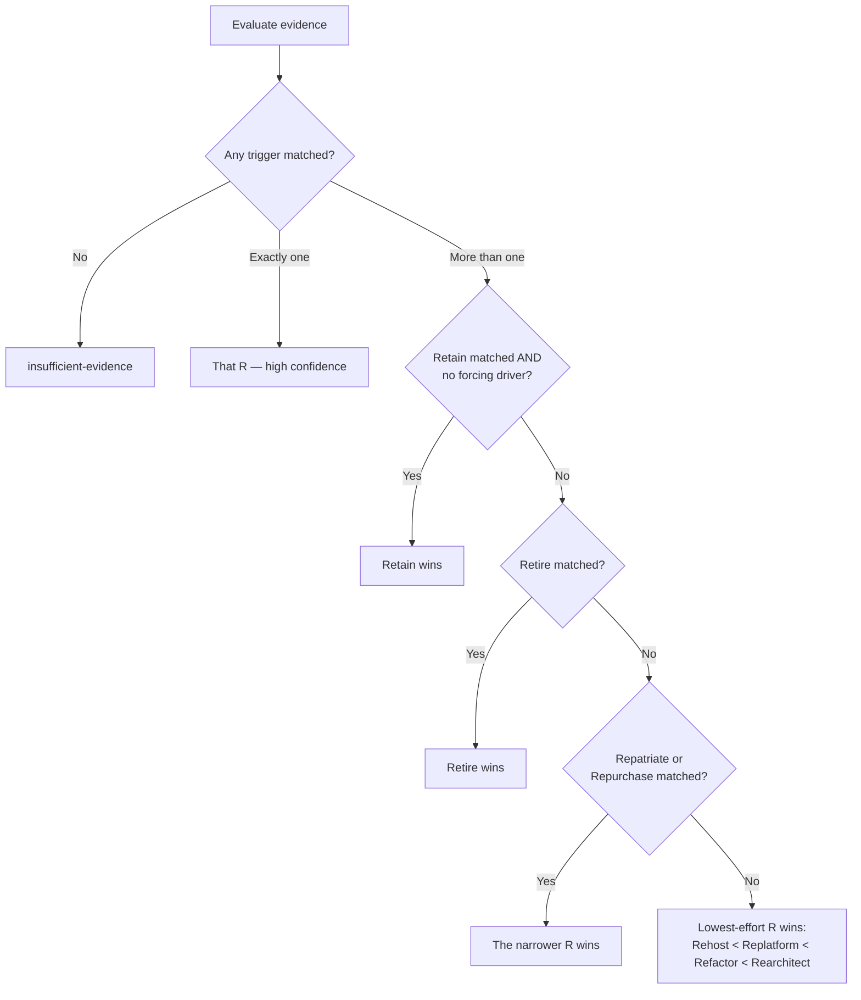

# The 5/7-Rs rubric

This is the plain-language explanation of `internal/rubric` and `internal/debtdelta` — the
part of OpOrder that turns gathered evidence into a recommendation. It exists so a skeptical
reviewer can audit the reasoning without reading Go source, per SPEC.md §8.

> [!NOTE]
> **Scope of this page.** It documents the 5/7-Rs call and the debt-delta model, both of which
> are real, tested code today (`internal/rubric`, `internal/debtdelta`), wired to one real
> evidence signal (AWS CloudWatch utilization — see [Where evidence comes from
> today](#where-evidence-comes-from-today)). It does **not** document Well-Architected
> scoring (SPEC.md §5.4) — that's M4 scope and isn't built yet. A section will be added here
> once it is, not before; documenting a rubric that doesn't exist yet would be exactly the
> kind of overclaiming SPEC.md §11 exists to catch.

## The core idea

Every workload gets scored against **explicit, documented triggers** — never a bare model
call with no visible reasoning. Each trigger is a pure function of *evidence*, and evidence
comes from elsewhere in the pipeline (code analysis, live infrastructure, correlation) before
the rubric ever runs. `internal/rubric` itself never calls an LLM and never touches a network
— it's ordinary, readable, unit-tested code, on purpose: SPEC.md §1 requires every scoring
decision to be auditable, which rules out a model call standing in for one.

## Evidence

`rubric.Evidence` is a flat struct of boolean signals — one or more per trigger below. A field
left `false` means **"no evidence found," not "confirmed false."** That distinction matters:
it's what lets the rubric say "insufficient evidence" honestly instead of quietly treating a
gap in data-gathering as a negative signal.

`TelemetryAvailable` is the one field that gets checked on its own, separately from the rest:
if nothing else was gathered and no telemetry exists either, the rubric returns
`insufficient-evidence` immediately rather than guessing from nothing.

## The eight triggers

("The 5/7-Rs" is SPEC.md's own name for this — Retain and Repatriate are the two
zero-migration-work outcomes weighted identically to the other six, not counted as a distinct
pair in the name.)

| R | Trigger |
|---|---|
| **Retain** | Low business criticality, acceptable current cost, no compliance or EOL driver forcing action |
| **Repatriate** | Steady-state predictable load + high egress cost + cloud premium exceeds owned-hardware TCO over the depreciation horizon |
| **Rehost** | Containerizable or VM-portable, no proprietary managed-service dependencies detected, migration deadline is the dominant constraint |
| **Replatform** | 1:1 managed-service swap available (e.g. self-managed DB → managed DB) with minimal code change |
| **Refactor** | Proprietary dependencies with no target-platform equivalent, but the core logic is sound |
| **Rearchitect** | Monolith requiring decomposition to meet a stated goal |
| **Repurchase** | Equivalent SaaS/COTS functionality is cheaper than continued maintenance |
| **Retire** | Usage telemetry shows no or negligible traffic, or the workload is redundant with another system — gated on telemetry actually being available, so "no data" can never resolve to Retire by default |

**These are not mutually exclusive.** A real workload commonly matches more than one — a
service with no compliance driver (Retain's trigger) that's also cleanly containerizable
(Rehost's trigger) is normal, not an edge case. `matchedTriggers` evaluates every trigger
independently and never stops at the first match.

## Resolving a tie

When more than one trigger matches, the rubric applies a fixed resolution order — most
conservative first:

1. **Retain wins**, unless a forcing driver is present (an EOL deadline, a compliance
   requirement, unacceptable ongoing cost, or an explicitly stated architectural goal).
   Recommending action with no forcing reason would contradict SPEC.md §1's requirement that
   Retain be a real, equally weighted outcome — not the option nobody reaches because a
   flashier R also technically qualified.
2. **Retire wins next**, when it matches — SPEC.md §5.8 calls it "the only unambiguous R,"
   since eliminating a genuinely unused workload is never the wrong call once its trigger
   (telemetry-backed) is actually satisfied.
3. **Repatriate or Repurchase win** over the general migration path, since their triggers are
   more evidence-specific than a generic "this could be rehosted" match.
4. Otherwise, the **lowest-effort R that still satisfies every matched trigger wins** —
   Rehost before Replatform before Refactor before Rearchitect — on the grounds that the
   burden of proof rises with the scope of change being recommended.

Every tie-break the rubric applies is shown in the output alongside the call — a silent
tie-break would be exactly the "opaque model call standing in for a documented rubric" SPEC.md
§1 rules out.

## Confidence levels

| Confidence | When |
|---|---|
| `high` | Exactly one trigger matched — nothing to resolve |
| `medium` | More than one trigger matched, resolved via the tie-break rules above |
| `low` | Reserved for future evidence-quality signals; not currently produced |
| `insufficient-evidence` | No trigger matched, or no evidence was gathered at all |

A rubric that never admits uncertainty is worse than one that admits it too often — `low` and
`insufficient-evidence` are real, first-class outcomes, not hedges.

## Debt trajectory (§5.8)

Alongside the R itself, `internal/debtdelta` projects whether the organization's technical
debt goes down, stays flat, or goes up if that R is carried out:

| R | Trajectory | Why |
|---|---|---|
| Retain | `unchanged` | Nothing moves — the debt profile is unchanged by definition |
| Rehost | `usually-unchanged` | Lift-and-shift relocates code without touching it |
| Replatform | `modest-reduction` | Removes operational debt of self-managing a piece, not application-level debt |
| Refactor / Rearchitect | `risk-of-increase`, `reduction-if-executed-well`, or the default case | Depends on execution context — see below |
| Repurchase | `reduction` | Removes in-house debt entirely, at the cost of new integration debt — both sides shown |
| Retire | `full-elimination` | The debt is eliminated along with the workload — deterministic, no execution context needed |
| Repatriate | `usually-unchanged` | Moves where a workload runs, not what it is — same reasoning as Rehost |

Refactor and Rearchitect are the only two Rs SPEC.md §5.8 calls out as having "the widest
variance of any R" — their trajectory depends on how the work is actually executed:

- **Heavy AI-generated code with light review** → `risk-of-increase`, citing GitClear's
  industry data (duplicated code blocks rose roughly 8x in frequency, "moved lines" fell from
  ~25% to under 10% of changed lines, as AI-generated code volume grew).
- **High existing SDLC maturity** (§5.5 — not built yet, so this branch isn't reachable from
  real data today) → `reduction-if-executed-well`.
- Neither signal present → `reduction-if-executed-well` as the honest default, not a coin
  flip.

Every trajectory in this table besides Refactor/Rearchitect's is a **projection derived from
what the R structurally does or doesn't touch**, not a measurement — `IsProjection` on the
result marks exactly which is which.

## Worked examples

Real output from `go run ./cmd/sample-report` — the actual `rubric.Evaluate` and
`debtdelta.Assess` functions, run against five illustrative (not live-scanned) workloads:

**billing-service** — proprietary dependencies, no target-platform equivalent, core logic
sound, heavy-AI-generation execution context:
> `refactor`, high confidence. Debt trajectory: `risk-of-increase` (the AI-generation-risk
> branch above).

**payments-api** — a 1:1 managed-service swap available with minimal code change:
> `replatform`, high confidence. Debt trajectory: `modest-reduction`.

**legacy-reports** — low business criticality, acceptable cost, *and* containerizable with a
migration deadline: two triggers match (Retain, Rehost).
> `retain`, medium confidence, tie-break applied: *"Retain matched alongside rehost, but no
> forcing driver (EOL, compliance, cost, or a stated architectural goal) is present — §5.3
> requires Retain to win rather than recommend action with no forcing reason."* Debt
> trajectory: `unchanged`.

**user-uploads** — telemetry available, negligible traffic:
> `retire`, high confidence. Debt trajectory: `full-elimination`.

**order-orchestrator** — a monolith with a stated decomposition goal, high SDLC maturity:
> `rearchitect`, high confidence. Debt trajectory: `reduction-if-executed-well`, citing strong
> existing test coverage and disciplined CI/review practice.

## Where evidence comes from today

This is the part most likely to be smaller than a reader expects, stated plainly rather than
implied away: as of this writing, exactly **one** real evidence signal feeds the rubric from
live data — AWS CloudWatch CPU utilization (`internal/provider/aws`'s `CPUUtilization`),
wired through `internal/scan` into `TelemetryAvailable` / `NoOrNegligibleTraffic`, and only
for workloads `internal/correlate` has already matched to a real AWS resource. Every other
field in `Evidence` — business criticality, compliance/EOL drivers, egress cost, proprietary
dependency detection, SaaS-equivalent pricing, and utilization on Azure/GCP/Cloudflare — isn't
gathered yet. In practice, most real workloads scanned today will land on
`insufficient-evidence`, and a workload with genuinely negligible AWS traffic will get a real,
single-signal `retire` call. Both are the rubric working correctly on the evidence that
actually exists, not a gap in the rubric itself.

See `internal/scan`'s package doc for the exact, current list of what's built and what isn't,
and SPEC.md §10's M2 milestone for what closes this gap.
